# clinic

## 开发文档

[](https://github.com/chuihairu/clinic/actions/workflows/maven.yml)

技术栈： 
- Java 17 TLS
- Spring Boot 3 
- React 18
- Ant Pro 6
- Nginx

### 目录

```
loader - 电脑客户端
web - 网页客户端
src - 服务端
```


查看本地文档docs:

- [本地加强文档](http://127.0.0.1:2347/doc.html)
### 环境依赖

#### 服务端

- Java 17 LTS
- Maven 3.9.1

### 项目初始化

假设已经clone项目，并进入了项目根目录:

```bash
mvn install #初始化依赖包
```

#### 客户端

- NodeJs 18
- React 18
- Electron 23

```
npm install -g pnpm
pnpm install
```

## 使用文档

### 登录


目前没有对接手机验证码，手机号登录暂时无法使用。

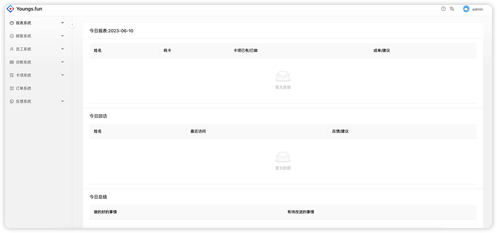
主界面

### 反馈系统
每日报表里展示了反馈系统里的填写的内容

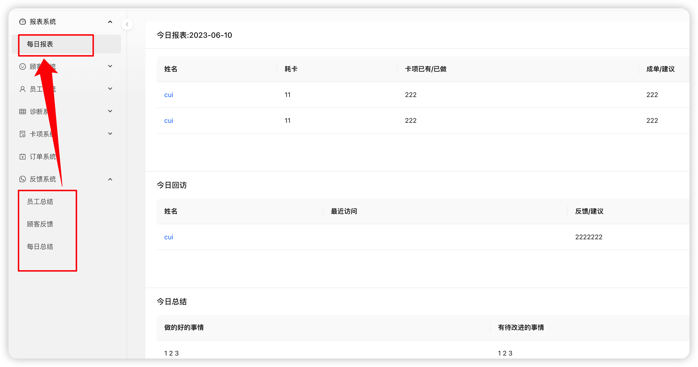

### 顾客系统

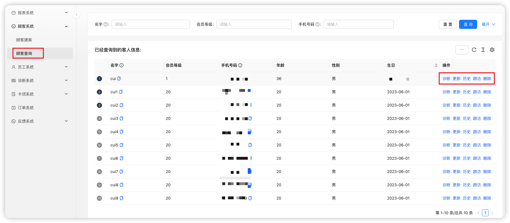

- 诊断 跳转为创建新的诊断表
- 更新 修改顾客的信息
- 历史 查看顾客的访问的历史记录，最近访问优先显示
- 跟访 设置一个未来的时间，到了时间会出现在每日报表里提醒去回访
- 删除 删除相关顾客的信息，目前没有设置权限区分，所有员工都可以删除，删除之后不可恢复

### 员工系统

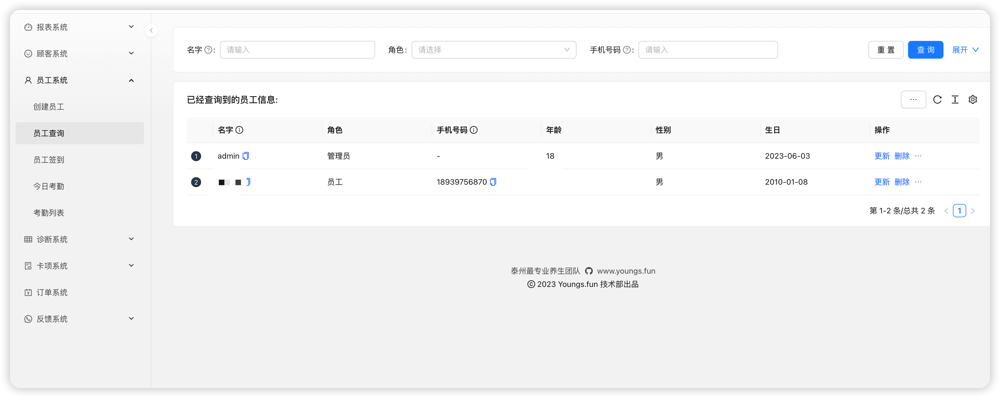

和顾客系统类似

#### 考勤

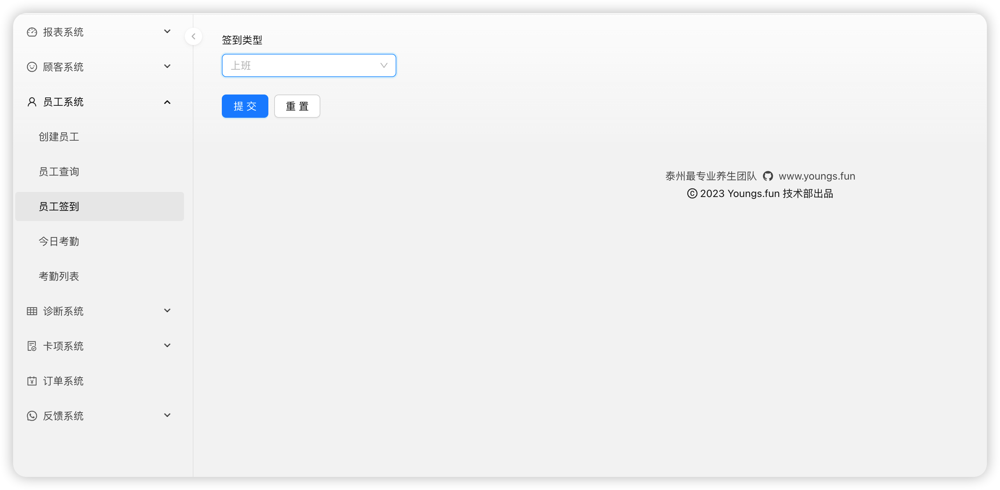

- 员工需要登录自己的账号
- 选择对应的类型签到

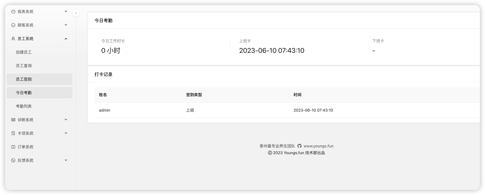

- 展示的精度为小时，不满一小时不显示
- 多次打卡上班卡，按最早的时间计算，多次打下班卡，按最晚的计算
- 没有打下班卡，那么展示当前时间到上班卡的小时

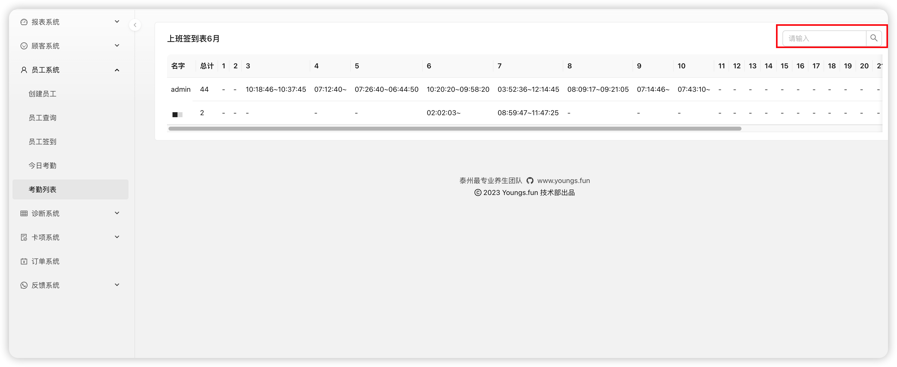
- 默认展示当前月的考勤表
- 统计总时长只统计了完整的考勤记录,缺上班卡或下班卡不统计，但今日缺下班卡默认当前时间，划入统计，精度小时。
- 查看其他的月的考勤表，在搜索输入其他的月份搜索即可，目前只支持当年的考勤表查询。

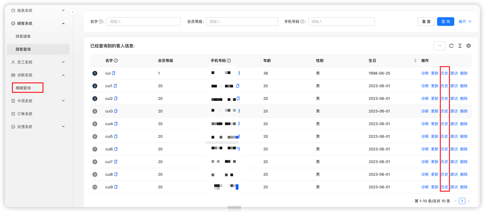

- 默认情况下先找到对应的顾客再查看历史，再历史里检索。
- 如果需要模糊查询某一个诊断单，可以使用模糊查询。

## 部署文档

采用的C/S模式，存在客户端和服务器端。

服务端建议部署在Linux环境，windows环境也可以。
需要局域网其他能访问的电脑上。

### 客户端

[网站](https://dash.youngs.fun)不需要部署，直接访问

电脑端，电脑端傻瓜式安装
但如果出现无法访问局域网服务器的情况，需要修改对应的配置。

### 服务器

#### Linux

##### MySQL 数据库

```
sudo apt install mysql-server
```

###### 创建数据库

```
mysql -u root -p
# 输入密码
mysql> create DATABASE clinic;
```

##### Java

```
sudo apt install -y openjdk-17-jdk
```

##### Nginx

```
sudo apt install nginx
```

部署SSL证书

```
sudo mkdir /etc/nginx/ssl
sudo cp dash.youngs.fun.pem /etc/nginx/ssl/
sudo cp dash.youngs.fun.key /etc/nginx/ssl/
```

修改nginx 配置

```
server {

    listen 80;

    # gzip config

    gzip on;

    gzip_min_length 1k;

    gzip_comp_level 9;

    gzip_types text/plain application/javascript application/x-javascript text/css application/xml text/javascript application/x-httpd-php image/jpeg image/gif image/png;

    gzip_vary on;

    gzip_disable "MSIE [1-6]\.";

  

    root /usr/share/nginx/html;

  

    location / {

        # 用于配合 browserHistory使用

        try_files $uri $uri/index.html /index.html;

  

        # 如果有资源，建议使用 https + http2，配合按需加载可以获得更好的体验

        # rewrite ^/(.*)$ https://preview.pro.ant.design/$1 permanent;

  

    }

    location /api {

        proxy_pass http://127.0.0.1:2347;

        proxy_set_header   X-Forwarded-Proto $scheme;

        proxy_set_header   X-Real-IP         $remote_addr;

    }

}

  

server {

  # 如果有资源，建议使用 https + http2，配合按需加载可以获得更好的体验

  listen 443 ssl http2 default_server;

  

  # 证书的公私钥

  ssl_certificate /etc/nginx/ssl/dash.youngs.fun.pem;

  ssl_certificate_key /etc/nginx/ssl/dash.youngs.fun.key;

  

  location / {

        # 用于配合 browserHistory使用

        try_files $uri $uri/index.html /index.html;

  

  }

  location /api {

      proxy_pass http://127.0.0.1:2347;

      proxy_set_header   X-Forwarded-Proto $scheme;

      proxy_set_header   Host              $http_host;

      proxy_set_header   X-Real-IP         $remote_addr;

  }

}
```

启动Nginx

```
sudo systemctl enable nginx
sudo systemctl start nginx
```

##### 部署网站

```
sudo cp -r dist/* /usr/share/nginx/html/
sudo mkdir /data/clinic
sudo chown ubuntu:ubuntu -R /data/clinic
sudo cp clinic-*.jar /data/clinic/clinic.jar
```


##### Systemd 配置

```
sudo cp clinic.service /lib/systemd/system/clinic.service
sudo systemctl enable clinic
sudo systemctl start clinic
```


#### Windows

##### MySQL 数据库

[点击下载8.0.32版本](https://cdn.mysql.com/archives/mysql-installer/mysql-installer-community-8.0.32.0.msi)

[知乎教程](https://zhuanlan.zhihu.com/p/455216177#:~:text=%E6%89%8B%E6%8A%8A%E6%89%8B%E6%95%99%E4%BD%A0%E5%9C%A8Windows%2011%E5%AE%89%E8%A3%85MySQL%208.0%201%201.%20%E5%AE%98%E7%BD%91%E4%B8%8B%E8%BD%BD%E5%AE%89%E8%A3%85%E5%8C%85%202%202.%E9%80%89%E6%8B%A9%E5%AE%89%E8%A3%85%E7%B1%BB%E5%9E%8B,5.%E7%82%B9%E5%87%BBExecute%E5%BC%80%E5%A7%8B%E5%AE%89%E8%A3%85%206%206.%E9%BB%98%E8%AE%A4%E9%80%89%E7%AC%AC%E4%B8%80%E4%B8%AA%EF%BC%8C%E7%82%B9%E5%87%BB%E2%80%9Cnext%E2%80%9D%E7%BB%A7%E7%BB%AD%207%207.%E7%82%B9%E5%87%BBExecute%E5%BC%80%E5%A7%8B%E5%AE%89%E8%A3%85%208%208.%E9%BB%98%E8%AE%A4%EF%BC%8C%E7%BB%A7%E7%BB%AD%E7%82%B9%E5%87%BBnext%20%E6%9B%B4%E5%A4%9A%E9%A1%B9%E7%9B%AE)


安装步骤：

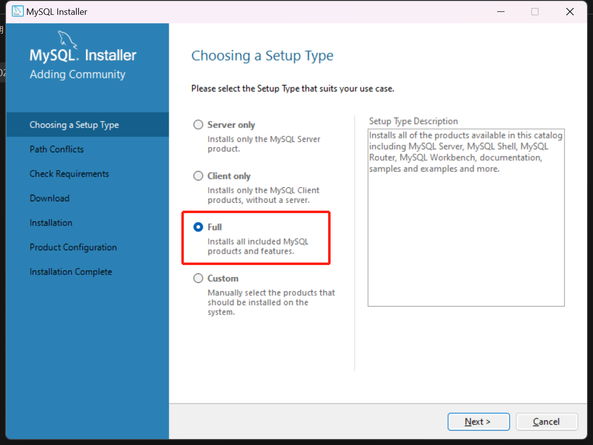

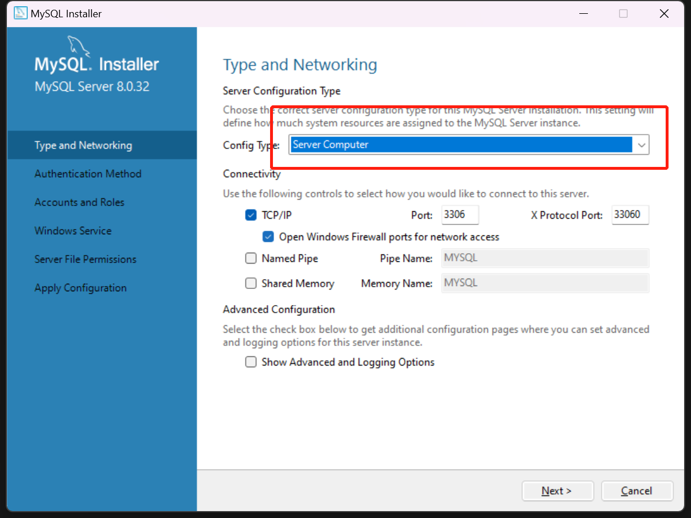

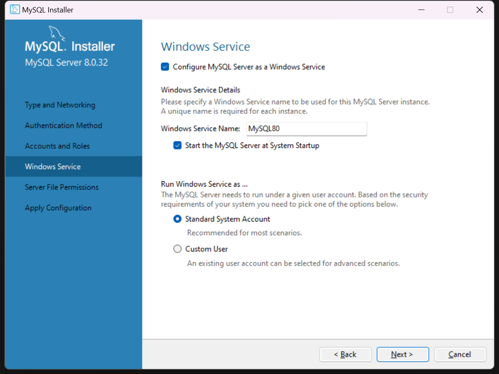
创建管理员密码

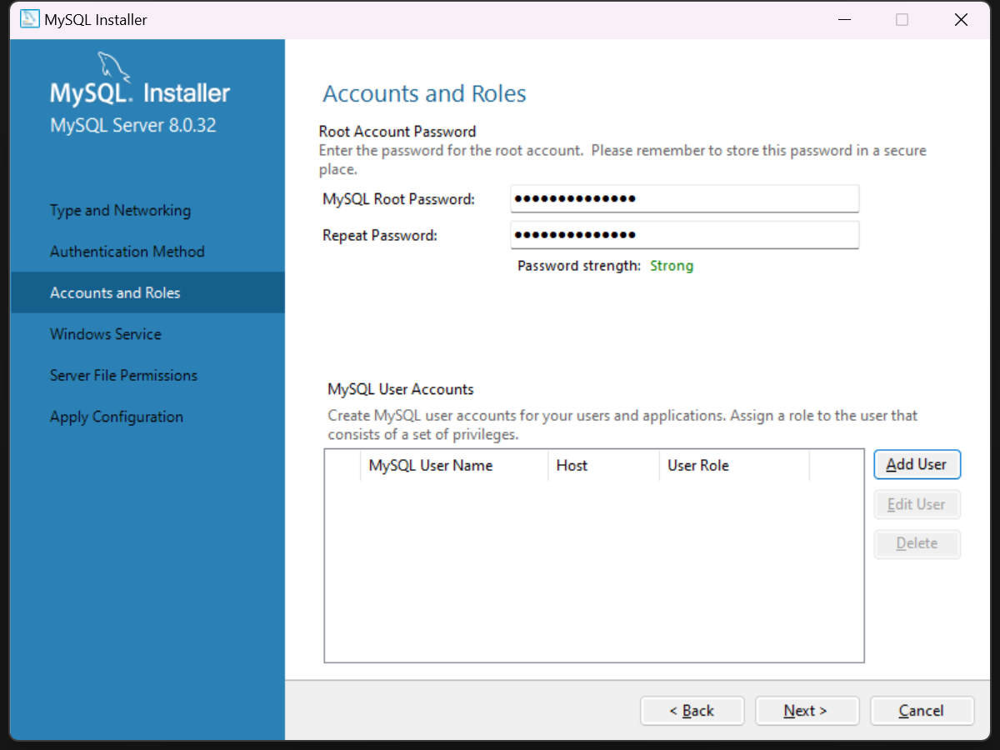

新建服务账号`clinic`并设置密码，Role 确保为`DB Admin`,密码等下需要使用。

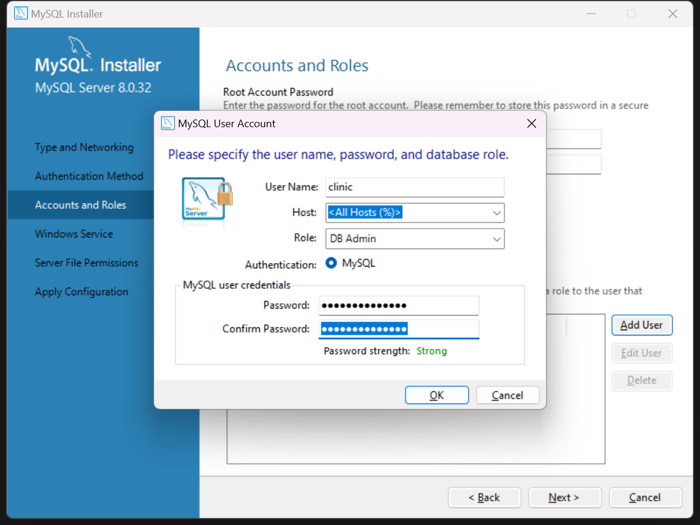

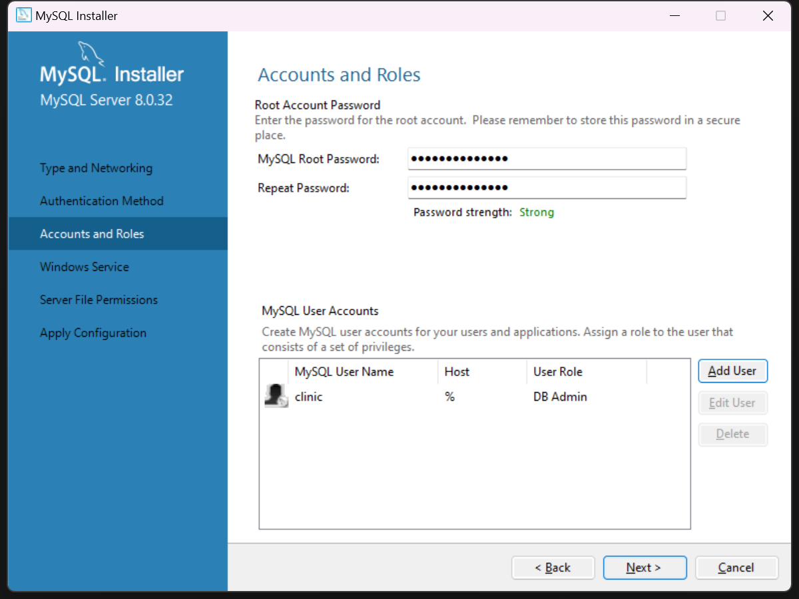
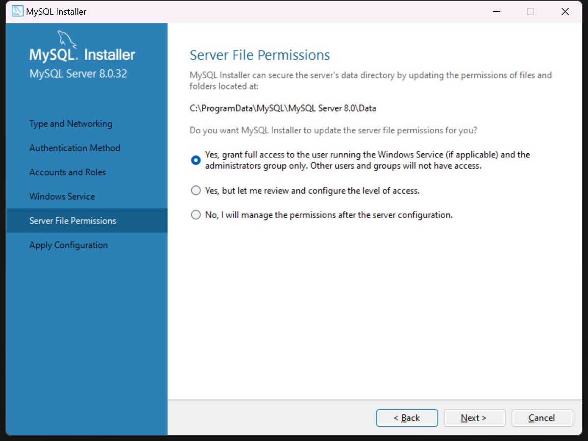
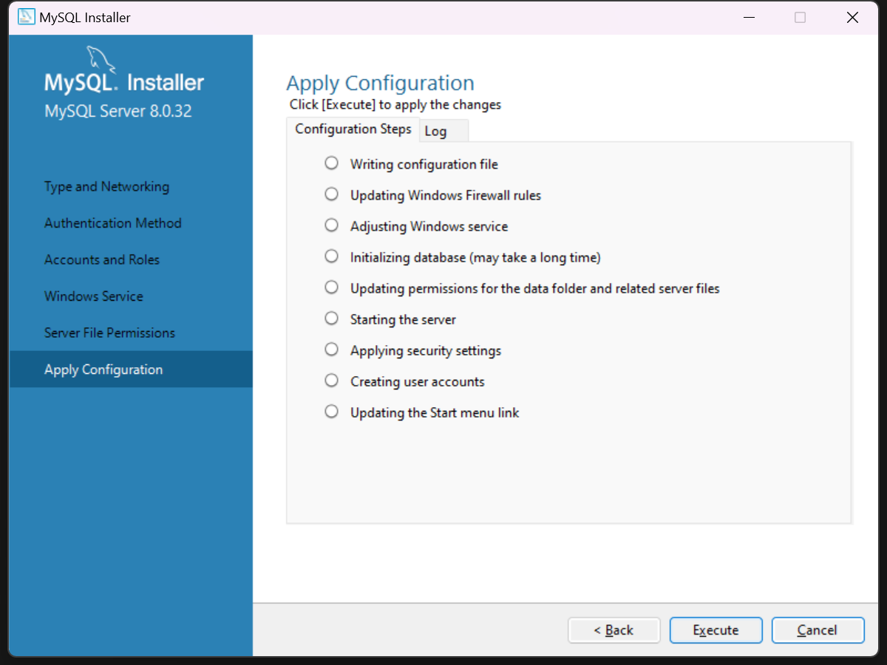
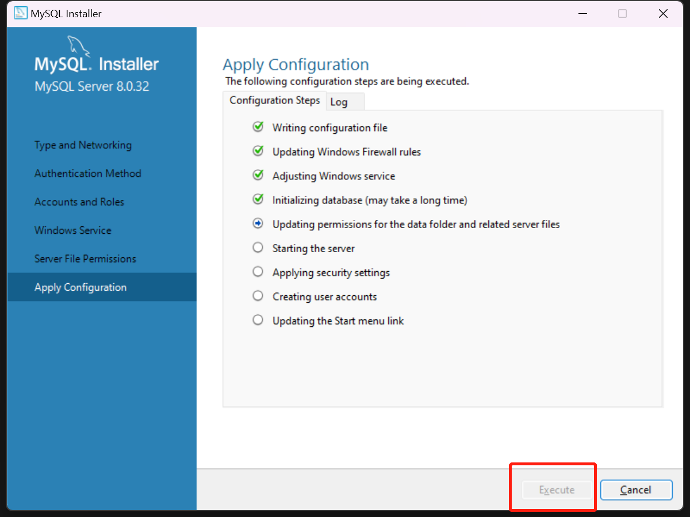
一直下一步结束安装

###### 创建数据库

```
mysql -u root -p
# 输入密码
mysql> create DATABASE clinic;
```

##### Java 

[Java 17 TLS](https://download.oracle.com/java/17/latest/jdk-17_windows-x64_bin.msi) 点击下载，傻瓜式，一直下一步。

[服务式部署教程](https://blog.csdn.net/qq3434569/article/details/102970341)

##### Nginx

[服务式部署教程](https://zhuanlan.zhihu.com/p/265119336)


