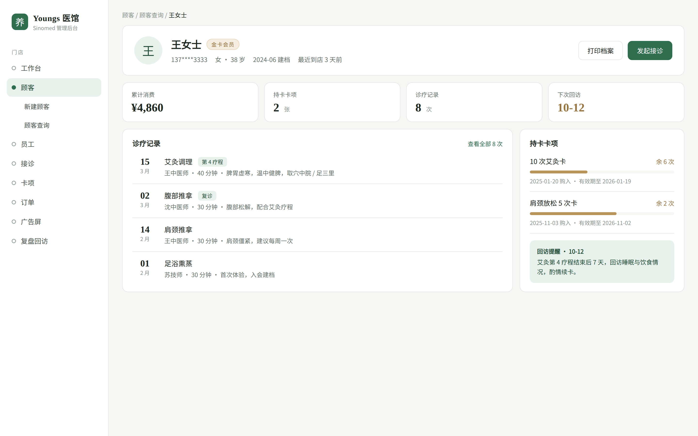
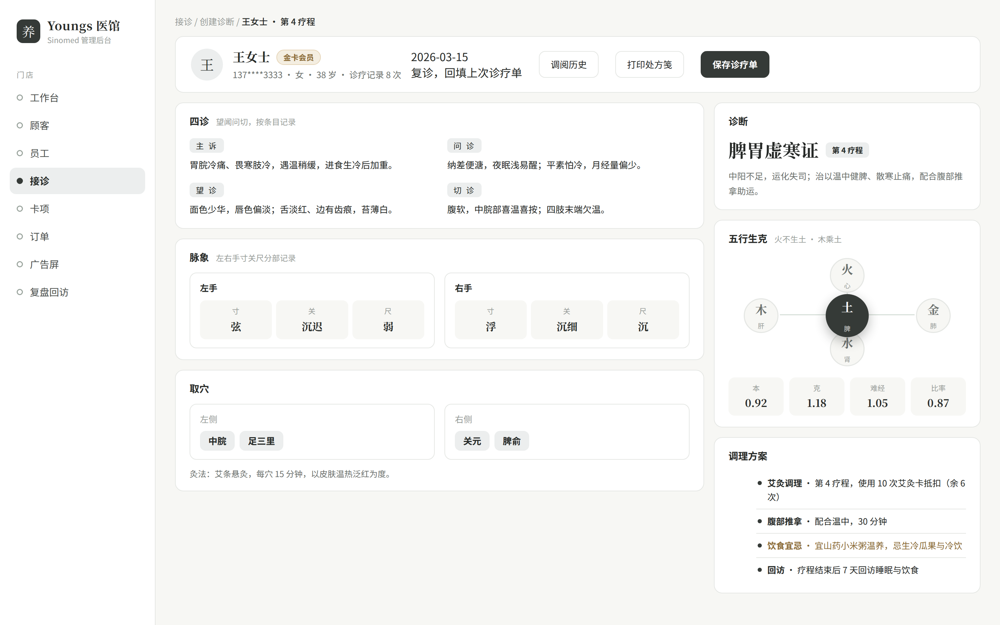
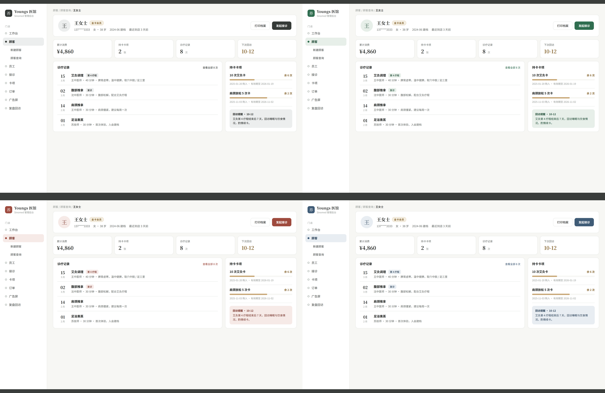
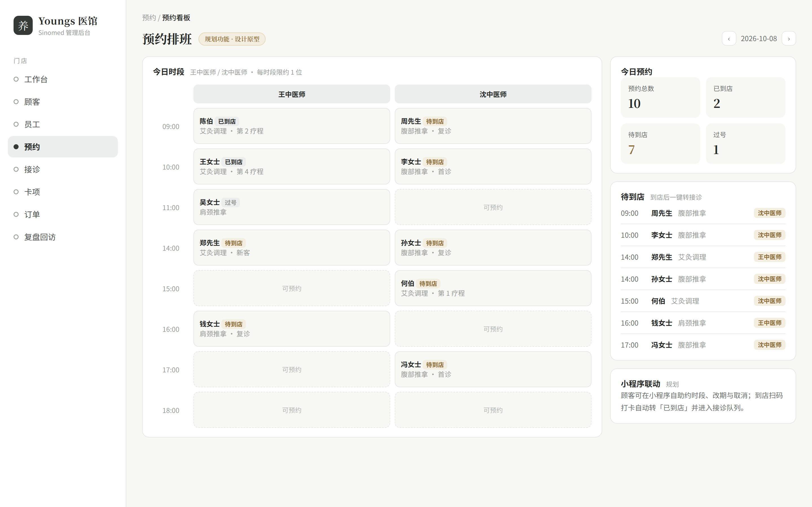
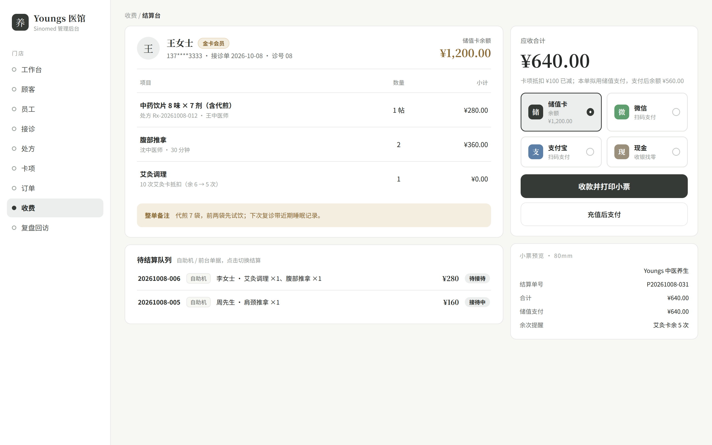
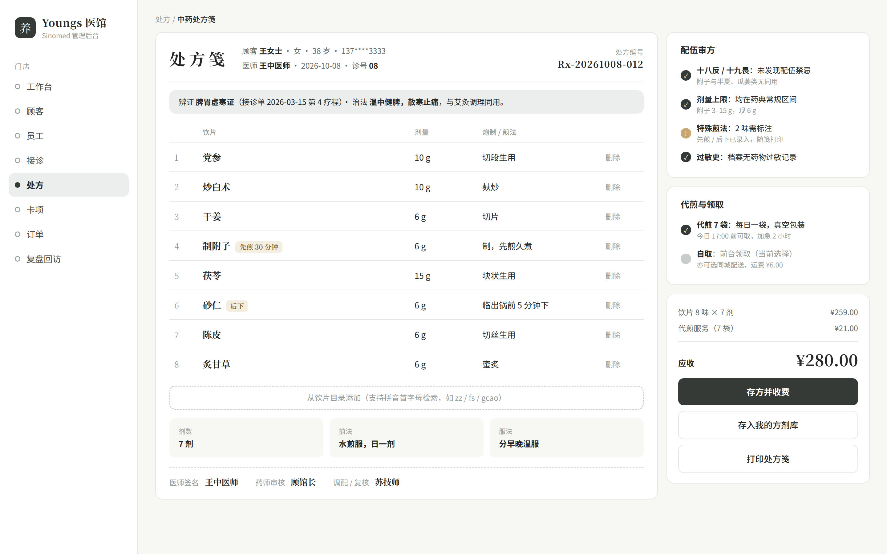
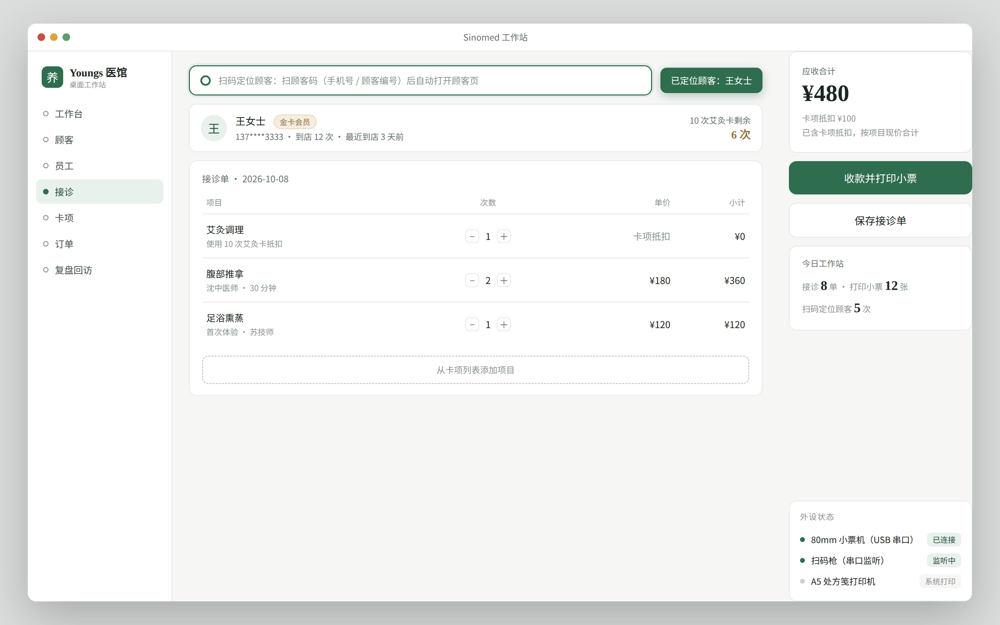
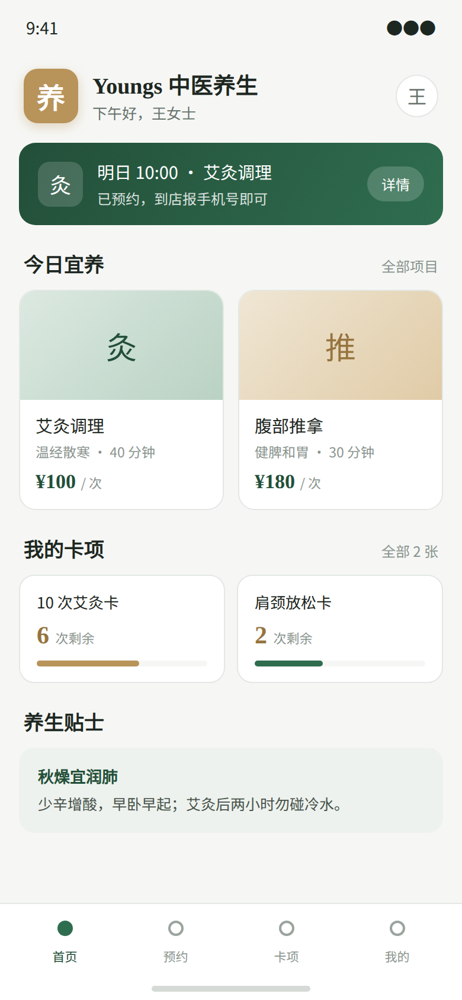
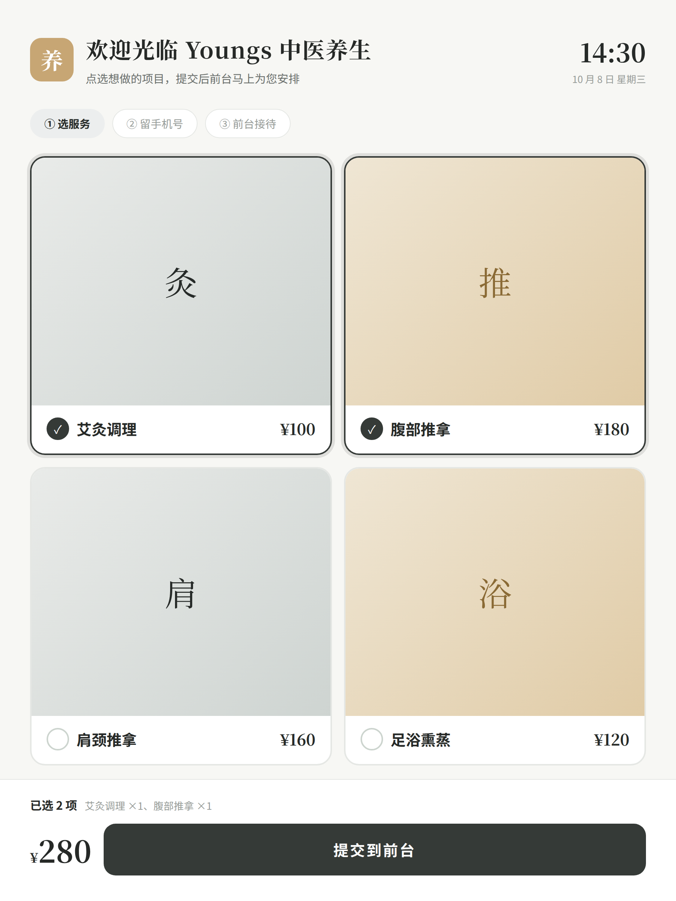

[English](README.md) | [中文](README.zh.md)

<h1 align="center">Sinomed</h1>
<p align="center"></p>
<p align="center"><b>TCM Clinic Management System</b>: customer records · treatment records · service packages · review and follow-up</p>
<p align="center">
  
  
  
  
  
  
</p>
<p align="center">Documentation site: <a href="https://cuihairu.github.io/sinomed/">cuihairu.github.io/sinomed</a></p>

## Demo Site

**Demo site https://sinomed.cuihairu.site/ (domain TBD, placeholder for now) | Demo account `admin` / `123`** (for sandbox exploration; data is reset periodically)

> The demo environment starts with a single `compose.yml` at the repo root: server + admin frontend + a persistent SQLite volume. With `DEMO_SEED=true`, it idempotently seeds a fully fictional, de-identified demo dataset (customers, TCM treatment records, service packages, review and follow-up, appointments, stored-value ledger, and pending-checkout orders). Staff demo accounts: `gu` (director), `shen` (TCM physician), `su` (front desk), all with the password `123`. Images are published to ghcr.io by CI (`latest` + `sha-<short commit>`).

## Product Preview

A single design language runs across five device targets: a graphite × antique gold theme (the grey and gold from the brand logo), a rice-paper background, and serif headings, plus three switchable theme colors — pine green, cinnabar, and indigo. Below are the interface prototypes for each target (design mockups; all data is fictional demo data). Source files live in [`docs/design/mockups/`](docs/design/mockups/).

**Admin frontend** (web · customer records / consultation chart)

<p align="center"></p>

<p align="center"></p>

**Theme switching** (admin frontend · appearance settings; four theme colors, one click each)

<p align="center"></p>

**Appointment scheduling** (admin frontend · booking / arrival list / arrival-to-consult handoff; the time-slot grid is a design prototype, mini-program self-service booking planned)

<p align="center"></p>

**Billing and checkout** (admin frontend · settlement desk: pending-checkout queue + stored-value / WeChat / Alipay / cash payments; the prescription line items, package redemption, and receipt printing from the prototype remain design drafts)

<p align="center"></p>

**Herbal prescription** (admin frontend · prescription create / query: herb doses and special decoction methods; compatibility review, pricing, and decoction service are planned features)

<p align="center"></p>

**Desktop workstation** (desktop · consultation charting + receipt printer / barcode scanner status)

<p align="center"></p>

**Mini program** (app · customer home; business pages planned)

<p align="center"></p>

**In-store kiosk** (kiosk · service selection and ordering)

<p align="center"></p>

**Waiting-area display** (tablet · promo carousel + queue calls)

<p align="center"></p>

The admin frontend also has prototypes for the daily report, service packages, orders, ad displays, appearance settings, and more; see [`docs/design/mockups/`](docs/design/mockups/) and the [documentation site](https://cuihairu.github.io/sinomed/).

## Planned Features (Design Prototypes)

For appointment scheduling, the admin-side list / booking / arrival handoff is implemented; for billing, the settlement desk with stored-value recharge is implemented; for herbal prescription, the sheet create / query is implemented — see Product Preview above. The remaining parts of each (time-slot grid, receipt printing and per-visit card deduction, compatibility review and decoction service) stay as design prototypes.

## Repository Layout

```
sinomed/
├── server/    # Server (Java 21 / Maven, includes Dockerfile and deployment scripts)
├── app/       # Mini program (Taro multi-platform project, Node.js 24, pnpm)
├── web/       # Admin frontend (Ant Design Pro / Umi, Node.js 24, pnpm)
└── docs/      # Documentation site (VitePress) and research notes
```

- Source code for `server/`, `app/`, and `web/` is maintained directly in this repository.
- Backend build (requires Java 21): `mvn -B package --file server/pom.xml`.
- Frontend build (requires Node.js 24): in `web/`, run `pnpm install && pnpm build`; the mini program under `app/` works the same way.

For details on each component, see the README in each directory and the [documentation site](https://cuihairu.github.io/sinomed/).
