# 商业产品调研:国内外中医/诊所管理系统

> 调研日期:2026-10-08。调研对象是**商业产品**(SaaS、桌面授权、项目制 HIS),与[开源项目盘点](/research/projects)互补。
>
> 方法与可信度口径:功能与价格优先取厂商官网/官方版本表;官网没有的取政府采购公告、上市券商研报、厂商在行业媒体发的稿子;再没有的取第三方评测站。凡是厂商自己的宣传数字(如「准确率 95%」「书写时间缩短 90%」),正文一律标成**厂商口径**,不作为事实引用。所有界面图存在 `docs/research/assets/`,图下注明原始 URL,均为 2026-10-08 访问所得;拿不到界面素材的产品在正文里写明「未取得」,不用示意图充数。

## 摘要:先说四条结论

1. **国内诊所级产品的价格带是三档**:免费到 2980 元/年(云中医专业版官方标价 2980 元/年/店)、数千到数万元买断或年费(一心医学按年或一次性买断;行业文章称 SaaS 年费普遍 5000-30000 元)、以及医院级项目制(卫宁健康门诊信息系统 V6.0 单套中标 138 万元,东华医为一个两院融合 HIS 项目 280 万元)。医馆规模买第三档是浪费,第一档又不够用,商业产品的主流落点是第一档往上、第二档往下。
2. **中医特色在国内诊所 SaaS 里已经是标配配置项,不是卖点**:舌象脉象是病历里的两个普通字段、方剂库(经典方/协定方/历史方)一键载入、饮片颗粒成药多库房、穴位字典、外治处方类型、审方预警——康博嘉、云中医、ABC、一心这四家的界面里都能直接看到。反观国外主流 EHR(Practice Fusion、Tebra、athenahealth、eClinicalWorks、Epic),没有一家做中医模块,中医从业者靠 Unified Practice、Jane 这类产品补位。
3. **界面形态高度趋同**:左侧模块导航 + 中间病历编辑 + 右侧辅助面板的三栏工作站,病历字段固定为「主诉/主症/兼症/舌象/脉象/辨病/辨证/处方」,处方区旁边挂方剂参考与禁忌提示。这套布局的目的只有一个:让医生在不切换页面的前提下完成一次接诊。
4. **定价模式决定产品形态**:按医生数订阅(Practice Fusion 199 美元/医生/月)、按流水抽成(athenahealth 官方口径「按收款比例」)、按医生类型+理赔量分档(Tebra 49-799 美元)、按项目一次性投入(Epic 单项目从 5000 万美元到 12 亿美元不等)。国内诊所 SaaS 多数照抄「按店按年」,医院级照抄「招标项目制」。

### 表 1:17 个产品总览

| 产品 | 地区 | 形态 | 定价模式(公开口径) | 中医特色 | 界面素材 |
| ---- | ---- | ---- | ---- | ---- | ---- |
| 康博嘉云诊所 | 北京 | SaaS | 订阅制,官网未标价,按诊所规模/模块报价(厂商 FAQ) | 病历字段含舌象脉象、证素辨证、经方库、饮片库房 | 3 张(官网) |
| 云中医(九明珠) | 江苏 | SaaS | 迷你版/标准版免费,专业版 2980 元/年/店(官方版本表) | 经典方/协定方/历史方、自动审方、饮片颗粒成药、代煎快递 | 5 张(官网) |
| ABC 诊所管家 | 成都 | SaaS | 免费试用,官网未公开报价 | AI 舌诊面诊、898 穴位、外治 6 类、颗粒机对接、多库房 | 2 张(官网) |
| 一心医学中医诊所管理系统 | 深圳 | Windows 桌面 | 3 天试用,按年付费或一次性买断,单机部署(官网) | 方剂名开方、针灸方案、十问歌辅助问诊、病症处方 | 4 张(官网) |
| 卫宁健康 WiNEX/门诊系统 | 上海 | 项目制 HIS | 招标采购,门诊信息系统 V6.0 单套 138 万元 | 无专属中医模块,中医医院按招标需求定制 | 1 张(健康界报道) |
| 东华医为 iMedical | 北京 | 项目制 HIS | 招标采购,两院融合 HIS 项目 280 万元 | 未见公开中医专项模块说明 | 未取得 |
| 创业慧康 | 杭州 | 项目制/云 HIS | 招标采购,月度中标额千万级(券商研报口径) | 宣称覆盖中医门诊,无细节 | 未取得 |
| 用友医疗 | 北京 | 项目制 HIS/HRP | 定制报价,按模块与用户数(第三方口径) | 以医院 HR/物资见长,无中医特色说明 | 未取得 |
| 金蝶医疗 | 深圳 | 项目制/云 | 行业文章称项目制 3-10 万元起(竞品文章口径) | 无中医特色说明 | 未取得 |
| Practice Fusion | 美国 | 云 EHR | 199 美元/医生/月,年付承诺,单一档 | 无 | 2 张(第三方评测站) |
| Tebra(Kareo+PatientPop) | 美国 | 云 EHR+PM | 49-799 美元/医生/月,按医生类型与理赔量分档 | 无 | 1 张(官网) |
| athenahealth athenaOne | 美国 | 云 EHR+RCM | 按收款比例抽成,官方不公布数字(第三方估 4-8%) | 无 | 1 张(官网截图页) |
| eClinicalWorks | 美国 | 云 EHR | 第三方口径 449 美元(EHR)/599 美元(含 PM)每医生每月 | 无 | 1 张(官网) |
| Epic | 美国 | 医院级 EHR | 项目制,公开案例 5000 万-12 亿美元 | 无;患者端 MyChart 有官方 App 截图 | 1 张(App Store) |
| Jane App | 加拿大 | 针灸/健康诊所 PM | 59/79/99 美元三档,按人头加价 | 无中医专属,模板可自定义 | 2 张(官网) |
| Unified Practice | 美国 | 中医垂直 EHR+PM | 第三方口径 49-99 美元/医生/月 | 穴位数据库 + 方剂库 + TCM 病历 | 2 张(官网) |
| myClinic | 新加坡 | 中医诊所 SaaS | 按团队规模分项报价,官网不公开数字 | 颗粒/耗材按克管理、舌脉写进预约备注 | 3 张(官网) |

---

## 一、国内产品

### 1. 康博嘉云诊所(康博嘉信息科技,北京)

**形态**:SaaS,官网称服务上千家医疗机构、连锁机构占比超 50%,已过公安部信息安全三级等保(以上均为厂商口径,来源:<https://www.karrytech.com/marketing_dry.html>、<https://www.karrytech.com/zhensuofuwu.html>)。

**核心功能模块**(来源:官网诊所 SaaS 页与 FAQ,<https://www.karrytech.com/zhensuofuwu.html>、<https://www.karrytech.cn/related_detail/1445.html>):预约挂号、分诊叫号、电子病历、智能处方、收费结算(支持诊间支付)、药品进销存、财务报表、患者随访构成主链路;外围是会员(RFM 标签分组、家庭组)、微信端预约与在线问诊、连锁集团管控(统一物价编码、跨店档案与会员互通、库房中心仓调拨)、OpenAPI 对接医保/LIS/PACS/煎药配送。

**定价模式**:订阅制,官网不公布数字,FAQ 只说「SaaS 订阅、无需购买服务器、1-2 天上手」。第三方行业文章给的区间是基础型 0.8-3 万元/年、中高端垂直型按规模与模块订阅——该文挂在竞品域名下(karrytech.com/share_detail/1451.html 是其自家营销稿),区间只能当参考,不当报价。

**界面**:

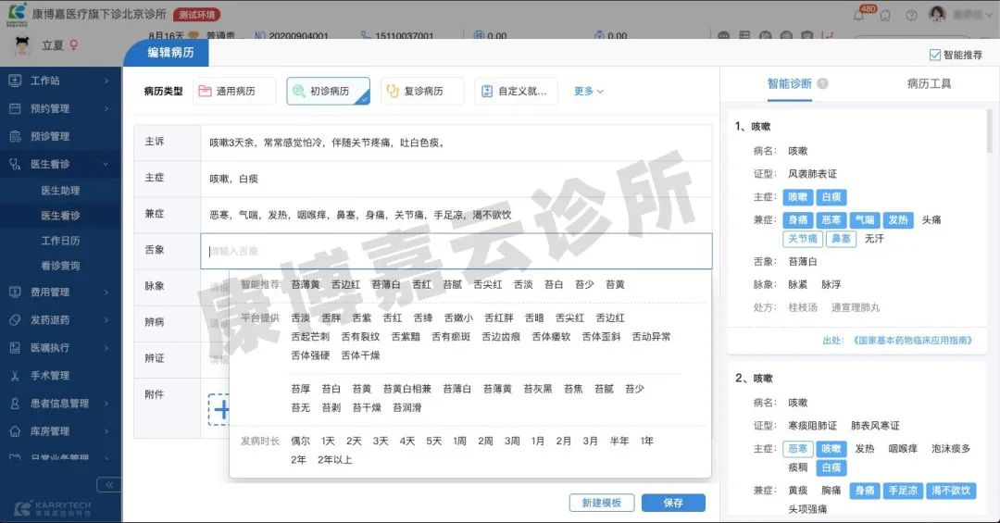
图 1 出处:<http://www.karrytech.com/share_detail/776.html>(康博嘉官网文章《浅谈康博嘉云诊所管理软件中的智能中医功能》配图,测试环境截图,2026-10-08 访问)

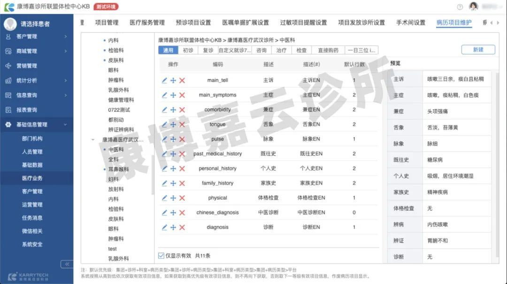
图 2 出处:同上

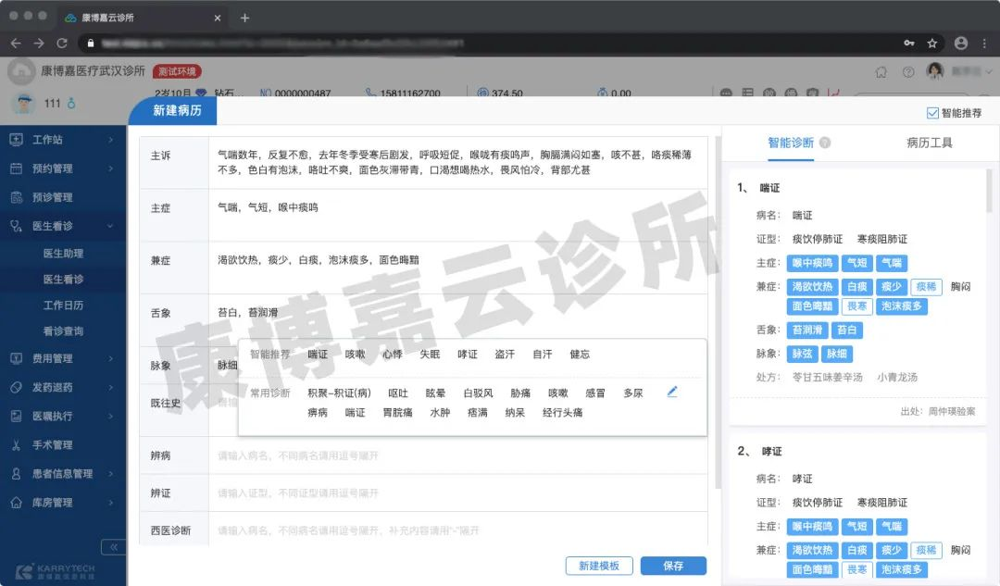
图 3 出处:同上

**中医特色**:病历字段把「舌象、脉象、辨病、辨证」与主诉并列(图 2);知识库口径为 1000+ 中医疾病、2000+ 中医证型、《伤寒论》经方 100+、《金匮要略》经方 200+(厂商口径,<http://www.karrytech.com/share_detail/776.html>);处方权限支持毒麻贵细药材的使用范围、剂量限制与审方流程(FAQ);库房支持饮片、中成药、耗材采购盘点调拨,库管员可用手机盘点。

**对应的分析——为什么要这样设计**。中医门诊的业务动因是「经验不可复制」:好中医少,年轻医生要靠系统把辨证思路补上,所以右侧诊断面板不是可选插件而是常驻栏,输入症状后直接推病名、证型、方剂并标出处,把「开病历」和「做辨证」合并成一次录入。用户角色上,这套界面同时伺候三种人:医生要快(拼音/五笔/语音录入、模板复用)、前台要流水(预约-挂号-诊间支付免排队)、老板要跨店数据(统一物价口径、集团报表)。效率与合规的取舍放在两处:病历字段做成可配置且带「集团>诊所>科室>病历类型」的优先级(图 2),是为了连锁总部定标准、单店留弹性;三级等保、数据可自主导出、处方权限与审方流程,是为了过监管和打消医馆对 SaaS 收走数据的顾虑——这三点直接对应《中医医院信息与数字化建设规范》对互联互通与等保的要求(该规范名见康博嘉 FAQ 引用)。

---

### 2. 云中医(九明珠)

**形态**:云平台,官网分柜台营业、医师辅助诊疗、药房进销存、财务结算、经营决策五大系统,另有自助挂号机、叫号屏、调剂终端、微信公众号对接(来源:<https://www.yunzhongyi.com/>、<https://www.yunzhongyi.com/html/ClinicFunction.html>)。

**核心功能模块**:预约、挂号、划价收费、会员储值、疗程管理、电子病历、电子处方、智能开方、自动审方、饮片/颗粒剂/成药进销存、丸散膏丹加工、代煎快递、医师提成与供货商结算、经营与患者分析报表、连锁资料共享(来源:官方版本表 <https://www.yunzhongyi.com/html/product_his.html>)。

**定价模式**:官方版本表写得最清楚——迷你版(无工作人员个体门诊)免费,标准版(小型门诊)免费,专业版(大型及连锁)2980 元/年/店;数据保存期迷你/标准 12 个月、专业永久;终端数 5/5/不限(同上)。免费版承担获客,专业版靠连锁与数据保留收费。

**界面**:

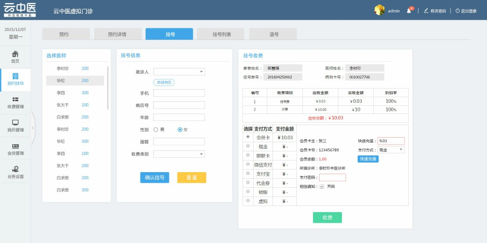
图 4 出处:<https://www.yunzhongyi.com/html/ClinicFunction.html>(云中医官网诊所系统功能页,2026-10-08 访问)

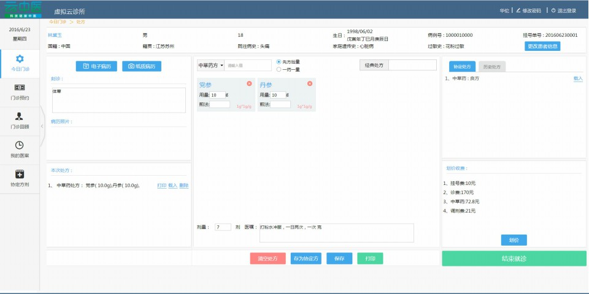
图 5 出处:同上

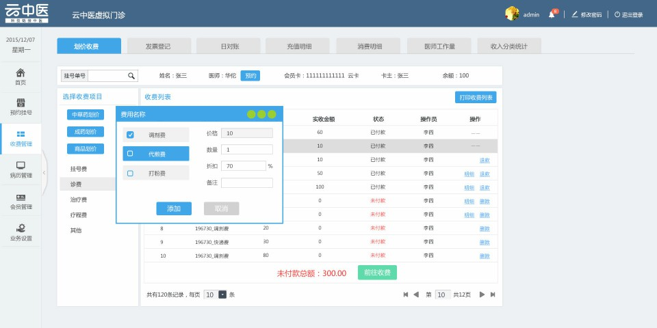
图 6 出处:同上

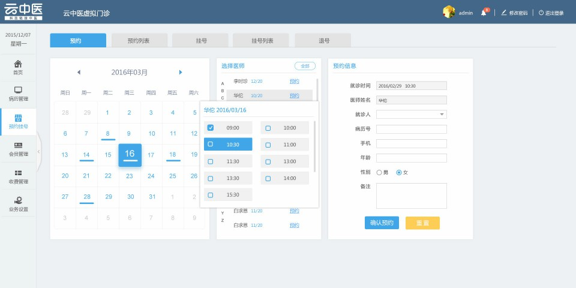
图 7 出处:同上

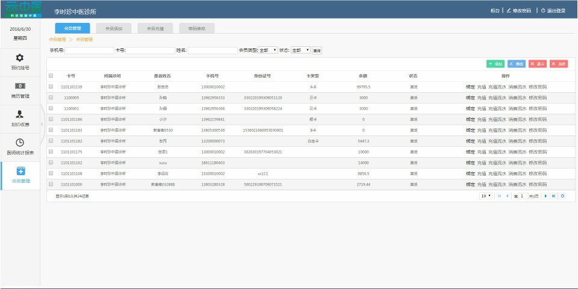
图 8 出处:同上

**中医特色**:中草药方、成药方、针灸方、理疗方四类处方;经典方、协定方、历史方一键载入(官网首页文案「30 秒开方」为厂商口径);自动审方;药房区分饮片、颗粒剂、成药三类库存,支持丸散膏丹加工与代煎快递单(版本表)。

**对应的分析——为什么要这样设计**。挂号、划价、开方三张图的布局一模一样:左侧模块树、顶部页签、中间表单——这是给前台和坐诊医生共用一台机器的诊所设计的,培训成本压到最低,新员工照着旧系统也能点。把「医师提成结算」「供货商结算」「日对账」做成一级功能,说明目标客户是把医生当合伙人、按流水分成的民营医馆,结算不清就留不住医生。数据保存期只给专业版永久,是免费版的留存钩子:个体门诊跑一年,历史病历还在平台上,升级就成了迁移成本。它的中医特色偏「抓药侧」而非「辨证侧」——有审方与多剂型库存,没有证型推荐,定位就是把药房与账目管住的经营系统。

---

### 3. ABC 诊所管家(成都,ABC 数字医疗云)

**形态**:SaaS,官网首页称 10 万+ 诊所使用(厂商口径,<https://www.abcyun.cn/>)。

**核心功能模块**:AI 语音病历、AI 舌诊/面诊、点选式病历输入、300+ 病历模板、AI 大模型推荐诊疗与处方、AI 处方审核(配伍禁忌与医保违规预警)、20 万+ 药品说明书、经方验方库、药品入库与效期/库存/毛利预警;中医特色页补了药房与外治(来源:<https://www.abcyun.cn/features/tcm-specialties>)。

**定价模式**:官网只给「免费试用」与咨询电话,不公开报价;开放平台单独一个域名(open.abcyun.cn),说明接口按合作方式谈。

**界面**:

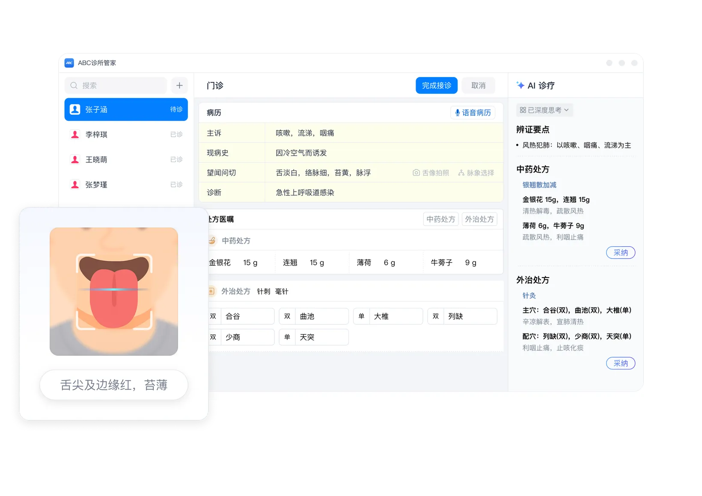
图 9 出处:<https://www.abcyun.cn/features/tcm-specialties>(官网图注「ABC中医特色诊疗功能界面示意」,2026-10-08 访问)

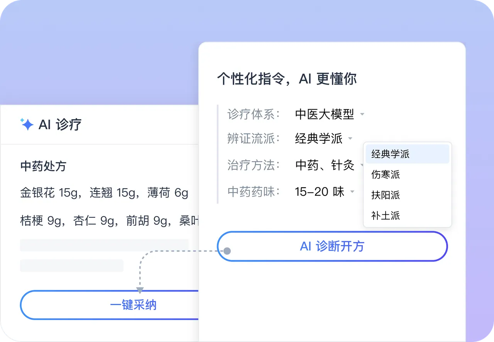
图 10 出处:同上

**中医特色**:舌像拍照与脉象选择直接做在病历字段里(图 9);外治处方覆盖贴敷、针灸、艾灸、拔罐、刮痧、推拿六类,穴位字典标称 898 个标准穴位(官网);药房支持中西成药、饮片、颗粒多库房与多人发药,处方收费后可直连颗粒机自动配药,另有「空中药房」代发与小程序自助续方;AI 舌诊面诊宣称准确率 95%、AI 大模型诊疗准确率 98%(均为厂商口径)。

**对应的分析——为什么要这样设计**。三栏各管一个人:左栏患者队列是前台与叫号的镜像,中栏是医生的工作面,右栏是 AI 的意见区,「一键采纳」的按钮位置决定了 AI 只能建议不能替签——处方责任在医生,这个交互边界是医疗合规要求画出来的,不是产品偏好。语音病历与点选输入解决的是基层医生写字时间不够的现实:厂商给的口径是省 90% 书写时间,拆开看动作只有两个,说话和点选,都不需要打字。把颗粒机对接和空中药房放进药房模块,是因为代煎与颗粒剂是医馆的利润项,少一个人工抄方环节就少一次错药风险,这也是饮片监管对「可追溯」的要求落到界面上的样子。

---

### 4. 一心医学中医诊所管理系统(深圳)

**形态**:Windows 桌面软件,单机部署(一台电脑做服务器),官网写明仅限 Windows(来源:<http://www.yixinyixue.com/aizs.html>)。

**核心功能模块**(官网列出 12 项):智能荐方、针灸方案、电子病历、电子处方、门诊收费、医师提成、会员管理、预约挂号、客户回访、复诊提醒、药房管理、数据统计。收费模块含处方收费、月/年统计、退费、医生业绩提成;药房含发药、采购计划、入库、报损、盘点。

**定价模式**:3 天试用;购买需提交诊所证件照与执业医师资格证;按年付费或一次性购买使用权(同上)。这是传统的授权模式,没有云端订阅,也没有持续的数据托管。

**界面**:

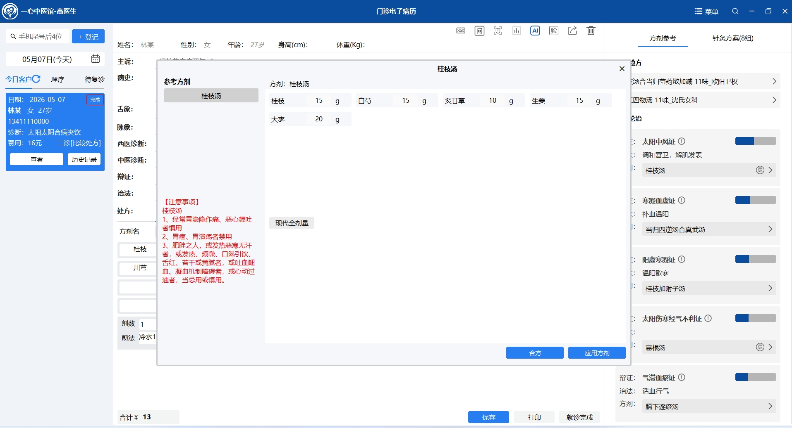
图 11 出处:<http://www.yixinyixue.com/aizs.html>(官网图注「中医诊所管理软件(中医馆管理系统)诊疗模块」,2026-10-08 访问)

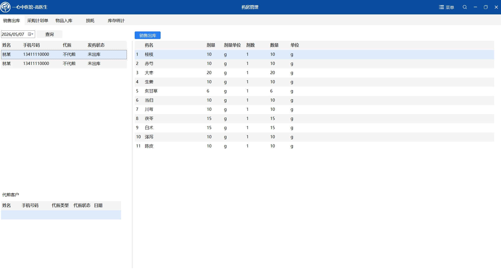
图 12 出处:同上

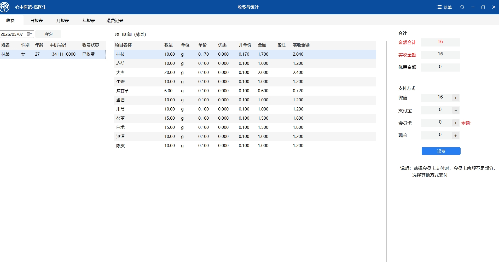
图 13 出处:同上

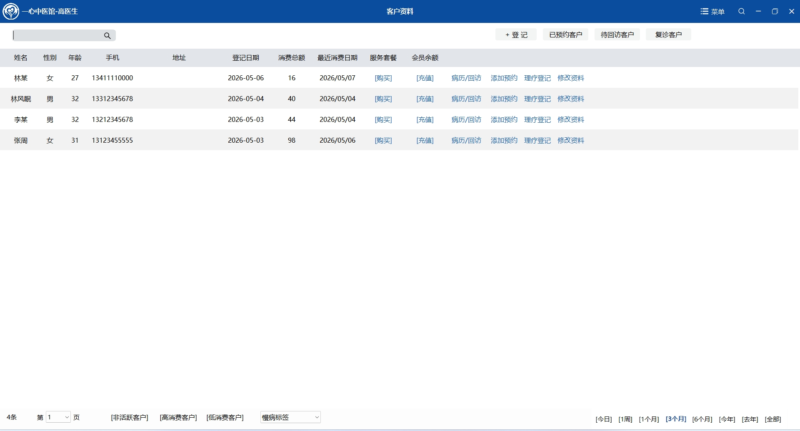
图 14 出处:同上

**中医特色**:按方剂名开方自动生成处方、病症处方模板、针灸方案(标称 1000+ 症状与疾病的针灸方)、按《十问歌》设计的辅助问诊防漏问、方剂详情弹窗列禁忌人群与「现代全剂量」「合方」按钮(图 11)。它把针灸和病历、处方挤在同一页,图 11 右栏还有「方剂参考/针灸方案(8 组)」切换。

**对应的分析——为什么要这样设计**。目标用户是个体中医与小馆,决策因素是价格和数据在自己手里,所以做成单机买断:不联网也能开方,不怕厂商跑路,代价是没有手机端、没有连锁聚合、升级靠重装。方剂弹窗把禁忌写在方名下面是给低年资医生看的——这类客户常常是刚出师的医生,开经典方最怕踩禁忌,提示比推荐更重要。回访和复诊做成列表顶部的两个按钮(图 14),对应中医调理的复购逻辑:疗程做完要有人提醒,这在西医诊所里优先级低,在中医馆里是营收来源。收费页同时放月报年报和提成,说明买单的是老板本人,报表要能直接对账分钱。

---

### 5. 卫宁健康(WiNEX / 门诊信息系统)

**形态**:上市医疗信息化厂商,项目制交付医院。IDC《中国医院核心诊疗系统市场份额,2024》口径下份额 12.6%(转引自 <http://www.cn-witmed.com/list/8/20398.html>),产品线是 HIS、EMR、PACS、LIS、集成平台,2020 年发布 WiNEX,2025 年发布 WiNEX2025(厂商口径,<https://www.cinn.cn/hz/2025/10-21/Zr5zYyzD.html>)。

**核心功能模块**:门诊医生站、住院医生站、病区护士站、病案管理等;WiNEX 门诊医生站把问诊、医嘱、病历放在同一屏,支持主诉检索、ICD-11 诊断、人体图点选开检查、常用药智能推荐、大处方风险预警、诊间挂号(来源:健康界报道 <https://www.cn-healthcare.com/article/20210803/content-558191.html>)。中医医院场景按招标文件定制,官网没有独立的「中医系统」产品页。

**定价模式**:政府采购招标。可查的公开标的是四川乐山市人民医院项目(2024-08-30,四川省政府采购网):总中标 2636 万元,其中**门诊信息系统 V6.0 单套 138 万元**、门诊药房管理系统 21.7 万元、门诊护士输液系统 22.4 万元、门诊分时段二次报道 20.5 万元(<https://ggzyjy.sc.gov.cn/jyxx/002002/002002003/20240830/8a69e1999184f5f101919dd2e09f0606.html>)。券商研报口径下,卫宁单个县级医院信息化项目多在 1000-2000 万元(<https://pdf.dfcfw.com/pdf/H3_AP202408111639231211_1.pdf>)。

**界面**:

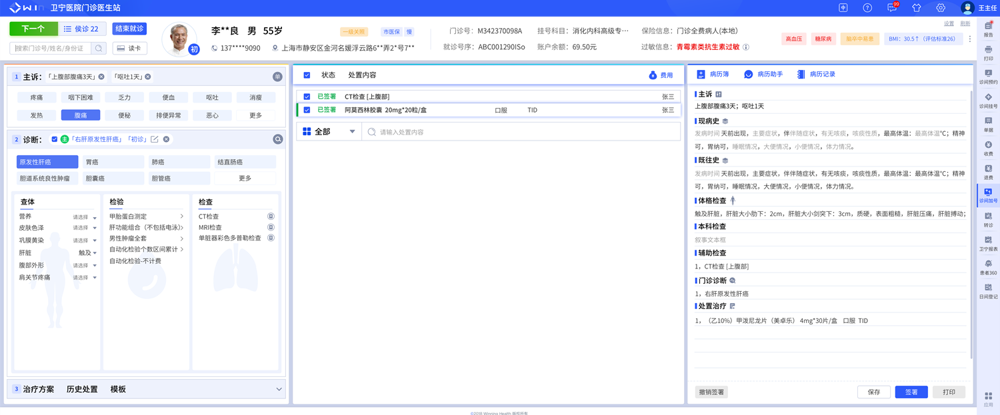
图 15 出处:<https://www.cn-healthcare.com/article/20210803/content-558191.html>(健康界《卫宁健康WiNEX系统应用效果如何?》文中配图「WiNEX门诊医生站界面」,2026-10-08 访问)

**中医特色**:无公开的中医专属模块。中医医院采购时把舌脉、辨证、饮片处方写进招标技术参数,由项目定制实现——公开可查的卫宁中标清单里有「东明县中医医院信息化建设项目 1550 万元」「天津市中医药研究院附属医院信息一体化升级 1588 万元」(券商研报口径),说明中医需求以项目形式承接,不以标准产品形式售卖。

**对应的分析——为什么要这样设计**。这一屏是给每天看几十个病人的医院医生设计的:顶部把过敏、医保类型、慢病标签做成常亮色块,是医疗安全要求——用药前必须看见过敏;左侧把查体、检验、检查做成快捷按钮加人体图,是因为医院流程里开检查单的频次比写病历还高,少一次页面跳转就少一次排队。它的复杂度来自角色与合规:医生站要接叫号、要接诊间收费、要接病案质控,这些在医馆里都不存在。价格上百万的原因也一样,买的是与院内 LIS/PACS/医保接口的对接、验收与三年运维,软件本身只是标的里的一项(见上文分项报价)。对医馆规模的采购方来说,这一档买的是「不用自己管 IT」,不是「功能更多」。

---

### 6. 同梯队大型厂商对照(东华医为 / 创业慧康 / 用友医疗 / 金蝶医疗)

这一组不逐家开小节,原因写在前面:四家的官网与公开渠道都以方案图、架构图为主,本次调研**没有取得任何一张可确认的软件界面截图**(东华医为官网 <http://www.mediway.com.cn/> 在本次访问中超时未返回;其余几家产品页未展示界面)。功能与价格仍有可查的公开证据,列在表里。

| 厂商 | 公开产品与定位 | 可查价格证据 | 中医相关 |
| ---- | ---- | ---- | ---- |
| 东华医为(iMedical/HOS) | 智慧医院、区域医疗、互联网医疗、医保控费;HOS 采用订阅(按年)交付口径 | 两院融合 HIS 多院区改造项目中标 280 万元(浙江文成县政府采购,2024-10-25,<https://www.wl.gov.cn/art/2024/10/25/art_1456452_59065648.html>) | 未见中医专项模块公开说明 |
| 创业慧康 | 云 HIS、互联网医院、区域医疗,基层与中医门诊覆盖率高(行业稿口径) | 2024 年 1-11 月累计中标 8.13 亿元,月度千万级(券商研报口径,<https://pdf.dfcfw.com/pdf/H3_AP202412061641205136_1.pdf>) | 行业稿称覆盖中医门诊,无功能细节 |
| 用友医疗 | 医院 HIS、HRP、医联体方案,优势在物资与财务 | 第三方称按模块与用户数、定制报价;用友 ERP 基础版 580 元/年起的定价只对应进销存,不是医疗系统 | 无中医特色说明 |
| 金蝶医疗 | 民营医疗与 DRG 结算工具见长(行业文章口径) | 行业文章称项目制 3-10 万元起,该文出自竞品站,只作参考 | 无中医特色说明 |

**对应的分析——为什么要这样设计(这一组为什么拿不到界面)**。它们的客户是医院与卫健委,采购看的是资质、案例数量、接口清单和验收条款,官网的作用是投标前的品牌背书,不需要展示操作界面;真正决定成交的是标书里的技术参数,不是截图。这解释了两件事:为什么这一档价格以百万计(对接与运维占比高),为什么中医功能只能在招标文件里定制(没有标准化产品可卖)。对医馆项目而言,这一组的可借鉴点在采购结构——按模块分项报价、验收后 1 年运维写进合同,而不是抄它们的界面。

---

## 二、国外诊所 EHR 与中医垂直产品

国外这一组的共同前提:美国门诊以保险理赔(RCM)为核心,预约、病历、开方、理赔四件事绑在一起卖;中医/针灸不在主流产品的字段体系里,由垂直产品补位。

### 7. Practice Fusion(美国,Veradigm 旗下)

**核心功能模块**:病历书写、预约排班、电子开方(含受控物质 EPCS)、检验与影像开单、患者门户、MIPS/合规报表;账单服务(RCM)是单独加购且需询价(来源:<https://www.practicefusion.com/pricing/>)。

**定价模式**:**199 美元/医生/月,单档、年付承诺、按月出账**;含 3 个可签署账号与无限非签署账号(前台、文档上传不计费,同上)。第三方复盘指出账单服务与销售税不含在 199 美元内(<https://pabau.com/blog/practice-fusion-pricing/>)。官网另挂 ONC 强制成本披露表(xlsx)下载,合规上必须公开价格构成。

**界面**:

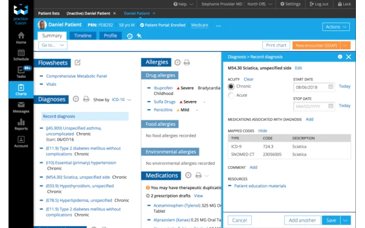
图 16 出处:<https://www.findemr.com/practice-fusion-ehr>(第三方评测站 FindEMR 收录的 Practice Fusion 截图,2026-10-08 访问;官网自身未公开界面图)

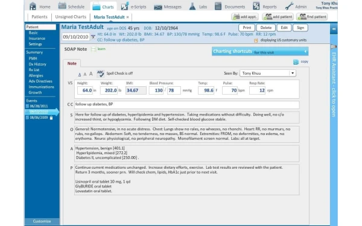
图 17 出处:同上

**中医特色**:无。官网与功能页没有针灸、草药或中医字段。

**对应的分析——为什么要这样设计**。199 美元单档是给 1-5 人的独立诊所准备的:他们没有采购经理,不想比较四个套餐,单一价格把决策成本压到「试两周」;无限非签署账号则是为了让前台、护士、兼职都进来用,按医生收费避免了「多一个人多一份钱」的内部阻力。病历界面把诊断、过敏、用药并排放在首屏(图 16),是保险理赔与用药安全共同要求的排布——诊断要挂 ICD-10 才能出账,过敏必须在开方前可见。它的界面不含中医字段,不是遗漏,是目标客户(全科/家庭医生)不写这些。

---

### 8. Tebra(Kareo + PatientPop 合并,美国)

**核心功能模块**:患者体验与营销、EHR、账单三个可单独买的产品,或 Practice Essentials / Practice Automation 两个打包;含电子开方、检验开单、HIPAA 远程问诊、患者门户、理赔资格核验(2700+ 付款方)、AI 笔记/语音/账单助手(来源:<https://www.tebra.com/pricing/overview>)。

**定价模式**:官网公布 7 档——营销 49 美元起、EHR Starter 99 美元起、Billing Starter 99 美元起、治疗师 225、非医师医生(NP/PA)399、医师 599、自动化档 799 美元/医生/月;低用量档(月理赔 ≤100 件)更便宜,连续 3 个月超量自动升档;AI 加购 99-149 美元/医生/月(同上)。支付手续费 2.75%+0.30 美元/笔、理赔附件 0.99 美元/份等写在定价政策页(<https://www.tebra.com/tebra-pricing-policy>)。

**界面**:

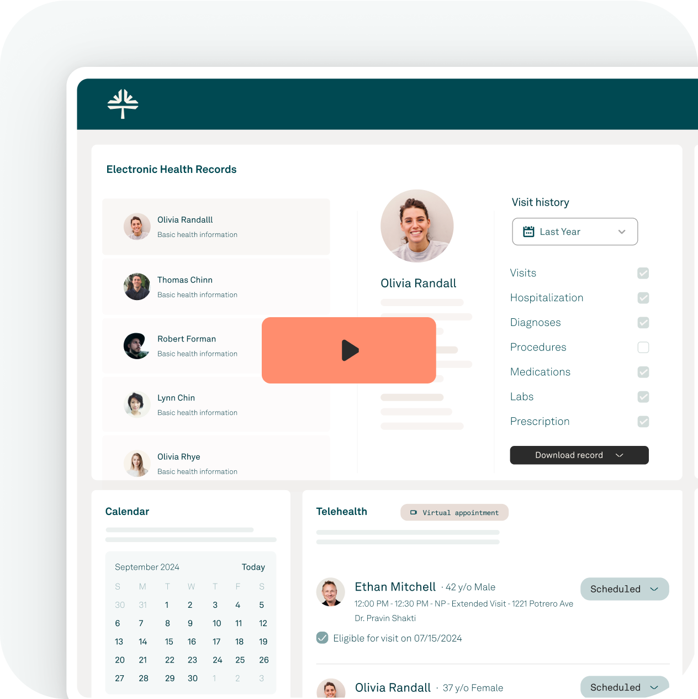
图 18 出处:<https://www.tebra.com/>(官网首页产品图,2026-10-08 访问)

**中医特色**:无。非医师医生档覆盖脊椎、心理治疗等,不含中医字段。

**对应的分析——为什么要这样设计**。七个价格档不是给用户挑的,是给「你属于哪类人」用的:医师/非医师/治疗师的区分对应执业范围与理赔能力,低用量档按实际理赔量算钱,是为了吃下兼职与新开诊所——这类客户最怕签年约,按量付费把入门门槛从 599 美元降到 99 美元。界面把日历和远程问诊放在病历页下方(图 18),因为独立诊所的排班与看诊是同一个人在管,拆成两个系统反而多一次切换。营销模块(建站、SEO、评价)被摆在第一个价位,说明这家公司的定位不只是记录工具,而是替诊所拉新——Kareo 的账单基因加 PatientPop 的获客基因,定价结构就是合并结果。

---

### 9. athenahealth athenaOne(美国)

**核心功能模块**:EHR(athenaClinicals)、账单(athenaCollector)、患者互动、远程问诊,以及 300+ 合作伙伴的集成市场;理赔规则库由网络统一维护,诊所不用自己养规则(来源:<https://www.athenahealth.com/solutions/athenaone>)。

**定价模式**:官方口径是**按诊所收款比例抽成**、无长期合同、可随时带走数据,不公布百分比(同上)。第三方行业口径估为 140 美元/医生/月基础费叠加收款的 4-8%,实施费 1.5 万-4 万美元(<https://transcure.net/medical-billing/software/emr/athenahealth-pricing/>、<https://saasrat.com/products/athenahealth>),标注为估算而非官方价目表。

**界面**:

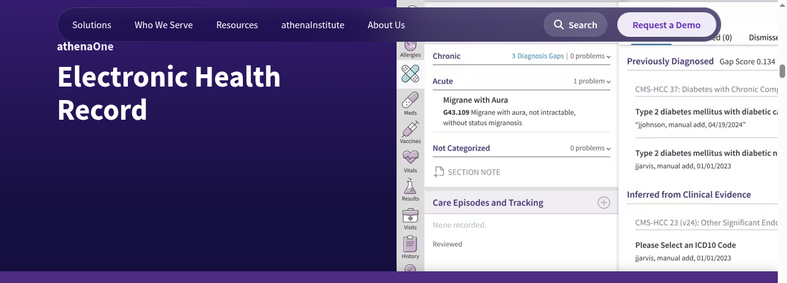
图 19 出处:<https://www.athenahealth.com/solutions/athenaone>(官网产品页截图,2026-10-08 访问,已裁去页面底部 Cookie 提示条)

**中医特色**:无。

**对应的分析——为什么要这样设计**。抽成模式把厂商收入和诊所营收绑在一起,所以产品必须替诊所把钱收回来:界面右侧那块「诊断缺口 / CMS-HCC 评分」不是临床工具,是理赔工具,提示医生哪些诊断还没编码进病历,漏写等于漏收。规则库放在网络侧统一更新,是因为美国付款方规则年年变,小诊所养不起合规团队,厂商把这件事变成规模生意。对中医医馆的参考价值在「按流水计费」这一层逻辑,具体实现(保险理赔、HCC 编码)在国内不适用。

---

### 10. eClinicalWorks(美国)

**核心功能模块**:云 EHR、远程问诊、患者互动(healow)、收入周期管理;官网首页与 EHR 页强调 AI 套件与 RCM 可视化(来源:<https://www.eclinicalworks.com/products/ehr.html>)。

**定价模式**:官网不公布数字;第三方口径为 EHR 449 美元/医生/月、含 PM 599 美元/医生/月,RCM 另按收款 2.9%(<https://softwarefinder.com/resources/practice-fusion-vs-eclinicalworks>、<https://startupstash.com/electronic-medical-records-emr-tools/>),标注为第三方口径。

**界面**:

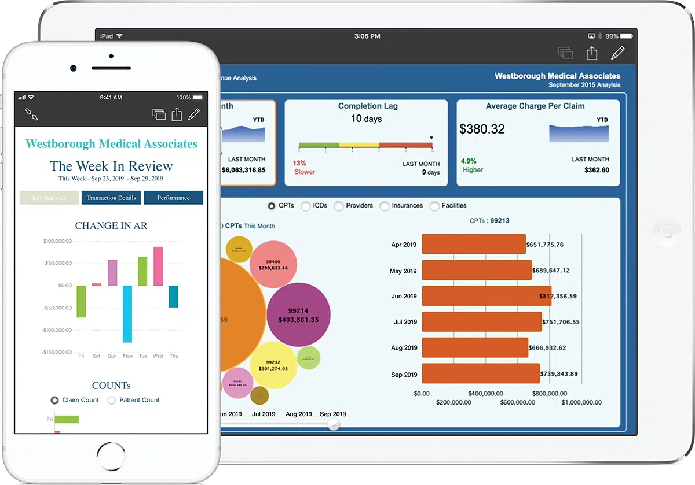
图 20 出处:<https://www.eclinicalworks.com/products/ehr.html>(官网 EHR 页配图,2026-10-08 访问)

**中医特色**:无。

**对应的分析——为什么要这样设计**。官网把收入分析图放在产品页最显眼处,说明它卖给诊所老板的核心承诺是「钱能算清楚」:应收变动、理赔完成延迟、单笔均价、按 CPT 拆收入,都是经营者每天要看的四个数,临床界面反而不作宣传。移动端做成周报/月报两种颗粒度,对应老板不坐班的使用场景。这一家对医馆的启示是报表层级——日结、周看趋势、月看结构,比一张总营收图有用。

---

### 11. Epic(美国,医院级)

**核心功能模块**:Hyperspace/Hyperdrive 临床工作站、MyChart 患者门户、Tapestry 商保理赔、 Cosmos 研究数据网络;面向医院与大型医疗集团(来源:<https://www.epic.com/software/>、<https://open.epic.com/Hyperdrive>)。

**定价模式**:不公开价目,项目制。公开案例:Health First 五年 1.6 亿美元、Sarasota Memorial 约 1.6 亿美元(<https://www.beckershospitalreview.com/healthcare-information-technology/ehrs/florida-health-system-invests-160m-in-epic-6-things-to-know/>);Becker's 汇总的 2024 年最贵十个 Epic 项目从 5000 万到 12 亿美元,历史最大项目 Kaiser 40 亿美元;Sacra 估实施费 100 万-5 亿美元不均、年许可约 1500 美元/医生(<https://sacra.com/c/epic/>)。

**界面**:

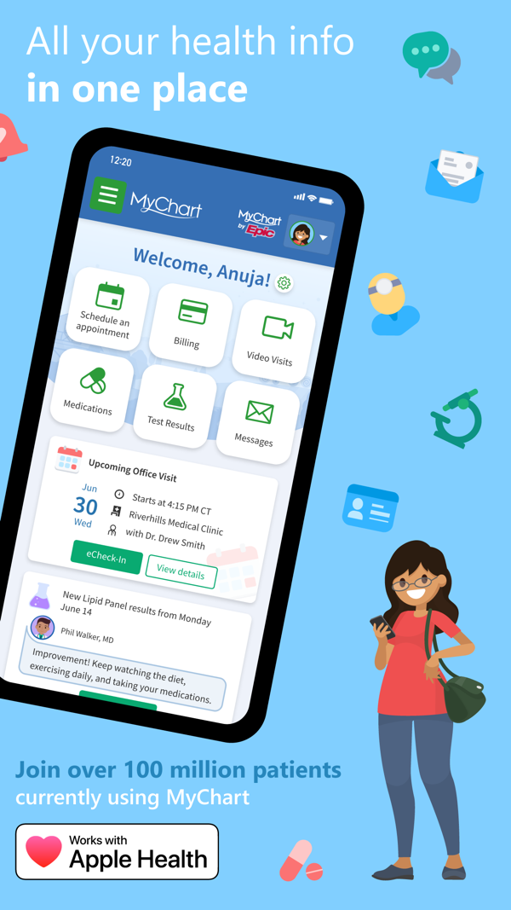
图 21 出处:Apple App Store,MyChart — Epic Systems Corporation(经 iTunes Search API 取得的官方截图,2026-10-08 访问);医生端 Hyperspace 界面受医院保密与 HIPAA 约束,公开渠道未取得

**中医特色**:无。

**对应的分析——为什么要这样设计**。Epic 的界面几乎不作公开宣传,因为卖的是实施与集成:医院买它,买的是跨院病历互通、科研数据与十年运维,操作界面由实施方按医院流程配置,厂商官网放图没有决策价值。患者端 MyChart 反而大方放截图——它是医院留住患者、减少电话咨询的门面,预约、检查结果、账单、消息全在一个 App 里,这是 Epic 门店级的护城河。对医馆的参照只有一条:患者自助入口(预约、报告、缴费)值得早做,医生端界面抄不了也轮不到抄。

---

### 12. Jane App(加拿大,健康与针灸诊所常用)

**核心功能模块**:日程排班(1 对 1/团体/课程)、在线预约站、病历模板与结局量表、远程问诊、发票与 CMS1500、短信提醒、AI 记录、套餐与会员、候补管理(来源:<https://janeapp.com/pricing/>)。

**定价模式**:官方三档——Balance 59 美元/月(单人、每月 20 个预约上限)、Practice 79 美元/月(含 1 名全职,兼职 17.5 美元/人/月、全职 35 美元/人/月)、Thrive 99 美元/月(房间与设备、候补、套餐与会员、评价);保险理赔是加购(同上)。

**界面**:

图 22 出处:<https://janeapp.com/>(官网首页产品截图,2026-10-08 访问)

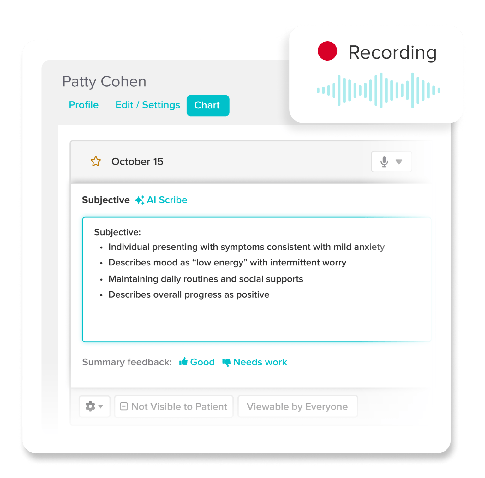
图 23 出处:同上

**中医特色**:没有中医专属字段,靠可自定义病历模板承接针灸与中医从业者;官网把它定位为健康与保健诊所通用。

**对应的分析——为什么要这样设计**。Jane 的排班页把「不同服务线并排成列」(图 22),直接对应针灸馆/理疗馆多技师同时排班的现实:一个馆里按摩、针灸、咨询并行,按人分列比按时间分列更容易看出空档。按预约量切第一档、按人头加价后面两档,是把定价和诊所规模精确对齐,单人兼职 59 美元就能起步,这和国内医馆先买单店版再买连锁版是同一个思路。它没有中医字段却在针灸从业者里流行,说明**排班与账单做好,临床字段可以由模板补**——这条对先做流程、后做中医字典的产品路线是个佐证。

---

### 13. Unified Practice(美国,中医垂直 EHR + PM)

**核心功能模块**:排班(按服务/房间/治疗师)、病历、开方、开票、支付、实时报表、患者沟通、患者门户、患者分群营销;官网标语直接写「Schedules. Communicates. Charts. Prescribes. Invoices. Manages.」(来源:<https://www.unifiedpractice.com/>)。

**定价模式**:官网不公布数字,提供免费试用;第三方口径为 49-99 美元/医生/月(Starter 49 美元起,含统一支付则更低、不含则更高),另加 32-38 美元/医生(年付口径,<https://www.vendorpick.ai/acupuncture>)。

**界面**:

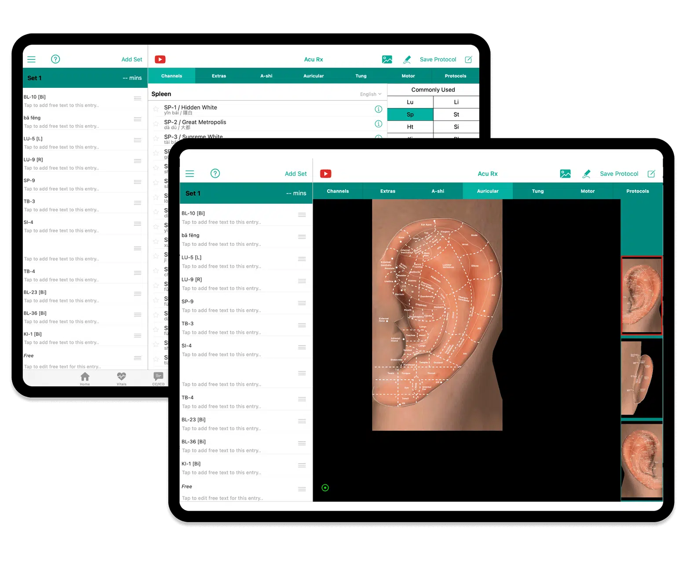
图 24 出处:<https://www.unifiedpractice.com/>(官网功能区截图,2026-10-08 访问)

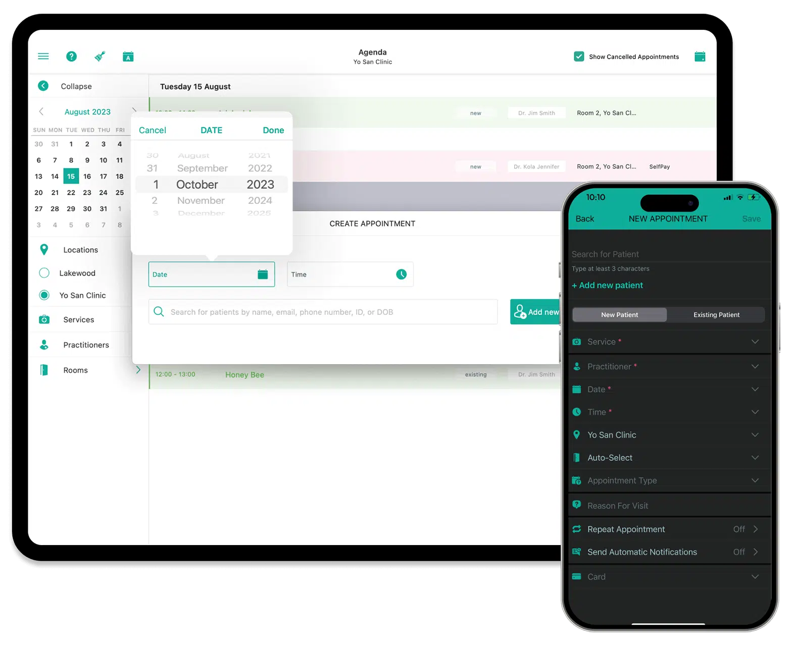
图 25 出处:同上

**中医特色**:第三方评测描述其内置**针灸穴位数据库与草药方剂库**,病历流程按 TCM 习惯设计(<https://www.vendorpick.ai/acupuncture>);官网标语为「TCM Solutions Crafted by TCM Practitioners」(中医从业者设计的 TCM 方案)。方剂与饮片库存的细节官网未展开。

**对应的分析——为什么要这样设计**。垂直产品的存在理由是字段:主流 EHR 的病历模板是 SOAP(主观/客观/评估/计划),中医写的是辨证与方剂,硬塞进 SOAP 每个字段都要解释一遍。Unified Practice 把穴位库和方剂库放进开方流程,省掉的是「翻书-抄写-核对」这三步,它的用户常常一人一诊室,时间就是营收。营销分群功能也被放进产品,因为美国针灸师大量依赖自费患者,复购提醒比保险理赔更关键——这与国内医馆的会员与回访逻辑一致,只是叫法不同。

---

### 14. myClinic(新加坡,中医诊所 SaaS)

**核心功能模块**:挂号、预约、看诊、收费、人员与库存;官网明确「前台、医师、收银共享同一实时状态」(来源:<https://www.sgmyclinic.com/zh>)。

**定价模式**:官网 FAQ 写「按团队规模与范围提供清晰分项报价,无隐藏费用」,不公开数字;演示约 15 分钟,数天上线,支持数据迁移。

**界面**:

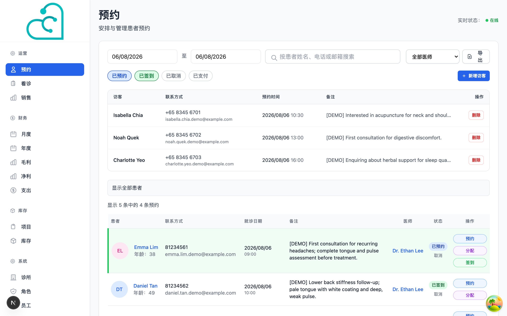
图 26 出处:<https://www.sgmyclinic.com/zh>(官网「真实界面展示」区,2026-10-08 访问)

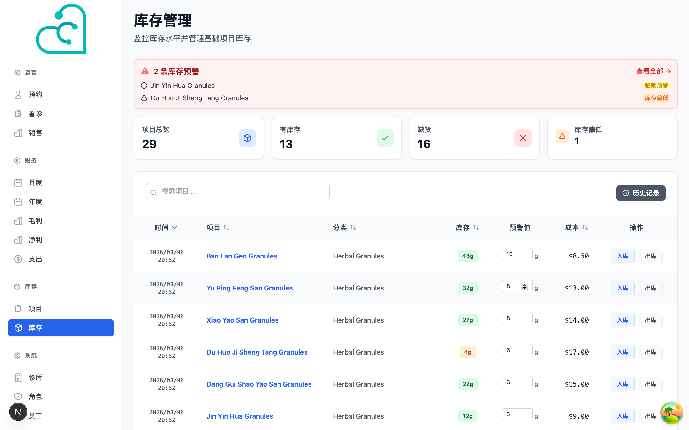
图 27 出处:同上

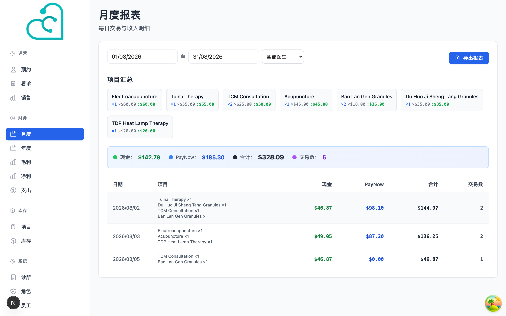
图 28 出处:同上

**中医特色**:颗粒与耗材**按克**管理并自动缺货/临期预警(官网);舌象脉象写在预约备注里(图 26 备注列可见 tongue and pulse、舌淡苔白脉沉弱的记录),患者建档时就能看到医师需要的辨证线索。

**对应的分析——为什么要这样设计**。新加坡中医诊所多为中小体量、自费为主、监管按 PDPA 走,所以产品把「共享实时状态」当第一卖点:前台改一个状态,医师和收银同时看到,省掉店里喊话——小馆最大的浪费是互相问。库存按克计价是颗粒剂的现实,一克差价乘以每天几十张方就是毛利,预警比报表先做出来。把舌脉放备注而不是结构化字段,是轻量化的取舍:先保证信息流到诊室,等客户长到需要辨证统计时再升字段。这种「先流程后字段」的顺序,和第 12 节 Jane 的结论一样。

---

## 三、定价模式对照

结论先行:17 个产品只有五种收钱方式,选择哪一种基本决定了产品卖给谁。医馆规模最匹配的是「按店按年 + 低门槛免费档」,因为它同时避开两头——医院级项目的实施成本,和按医生抽成对营收的绑定。国内已经有人把档位切好(云中医免费/2980 元),国外把按医生数的账算得很细(Jane、Tebra),这两套算账方式都值得抄,抄法见第五节。

| 收钱方式 | 代表产品 | 公开数字 | 谁在付钱 | 证据 |
| ---- | ---- | ---- | ---- | ---- |
| 按店按年 + 免费档 | 云中医 | 免费 / 2980 元/年/店 | 个体与连锁医馆 | 官方版本表 |
| 按年或买断的桌面授权 | 一心医学 | 3 天试用,按年或一次性买断 | 个体诊所 | 官网 |
| SaaS 订阅(不公开数字) | 康博嘉、ABC、myClinic | 官网只给试用与询价 | 中小医馆 | 官网 FAQ |
| 按医生数订阅 | Practice Fusion、Tebra、Jane、Unified Practice | 199 美元/医生/月;49-799;59/79/99;49-99 | 独立诊所 | 各家定价页 |
| 按收款抽成 | athenahealth、eClinicalWorks 的 RCM | 官方不公布(第三方估 4-8% / 2.9%) | 有保险流水的诊所 | 官方 + 第三方 |
| 招标项目制 | 卫宁、东华医为、Epic | 门诊系统 138 万/套、项目 280 万、Epic 1.6 亿美元 | 医院与集团 | 政府采购公告、Becker's |

---

## 四、中医特色功能横评

结论先行:国内四家诊所产品的中医功能落在同一条链上——**病历记舌脉 → 字典选证型 → 方剂库带出方 → 饮片颗粒分库 → 审方与禁忌提示 → 代煎/快递**;差别在重心:康博嘉偏辨证辅助,云中医偏药房与结算,ABC 偏 AI 与外治穴位,一心偏方剂与针灸方案。国外主流 EHR 这一列全是「无」,不是缺陷,是市场没要求;补位的 Unified Practice 只做了穴位库和方剂库,深度不如国内产品。舌诊影像采集(拍照/舌诊仪)目前只有康博嘉、ABC 在界面上给出入口,尚未见任何一家把脉诊做成客观采集——脉象仍然是下拉或点选的文本字段。

| 中医能力 | 康博嘉 | 云中医 | ABC | 一心医学 | 卫宁 | 统一 Practice | myClinic | 国外主流 EHR |
| ---- | ---- | ---- | ---- | ---- | ---- | ---- | ---- | ---- |
| 舌象记录/采集 | 字段+智能推荐 | 拍照采集 | 拍照+AI 舌诊 | 舌象字段 | 按项目定制 | 无 | 备注文本 | 无 |
| 脉象记录 | 字段+智能推荐 | 电子病历内 | 脉象选择 | 脉象字段 | 按项目定制 | 无 | 备注文本 | 无 |
| 证型/辨证推荐 | 证素→证型→处方 | 无(仅审方) | AI 辨证要点与流派设置 | 按辨证推方剂 | 无 | 无 | 无 | 无 |
| 方剂库 | 经方 400+(厂商口径) | 经典方/协定方/历史方 | 经方验方 | 方剂名开方+禁忌弹窗 | 无 | 方剂库 | 无 | 无 |
| 饮片/颗粒/成药多库房 | 饮片、中成药、耗材 | 饮片、颗粒剂、成药 | 中西成药、饮片、颗粒 | 药房五模块 | 按项目定制 | 未公开细节 | 颗粒按克 | 无 |
| 穴位字典/外治 | 未见 | 针灸方类型 | 898 穴位、外治 6 类 | 针灸方案 1000+ | 按项目定制 | 穴位数据库 | 无 | 无 |
| 审方/配伍禁忌 | 处方权限+审方流程 | 自动审方 | AI 审方+医保预警 | 方剂禁忌提示 | 按项目定制 | 未公开 | 无 | 无 |
| 代煎/加工/快递 | 对接煎药配送平台 | 代煎快递、丸散膏丹 | 空中药房、颗粒机直连 | 代煎状态列 | 无 | 无 | 无 | 无 |

---

## 五、可参考分析

结论先行:17 个产品逐一归类,每个只进一张表——**可参考 6 个**(国内四家诊所产品 + Jane + Unified Practice,界面与字段能直接进设计稿)、**可借鉴 5 个**(定价与报表做法,抄思路不抄实现)、**不适用 6 个**(五家医院级项目制厂商 + athenahealth,原因是规模或商业模式对不上)。归类标准就一条:拿它的做法放进 sinomed 的原型或功能清单,能不能写出下一条 todo;写得出就是可参考,只对定价与报表有用就是可借鉴,写不出就是不适用。

### 可参考(可直接进设计稿或原型)

| 来源 | 结论 | 为什么 | 落到 sinomed |
| ---- | ---- | ---- | ---- |
| 康博嘉病历项目维护(图 2) | **可参考** | 字段可配置 + 「集团>诊所>科室>病历类型」优先级,让一条病历模板同时服务连锁与单店;sinomed 诊疗单字段目前写死在 `treats` 表 | 新增诊疗单字段/模板配置的设计稿;接口按「模板-字段-优先级」建模,列入规划 |
| 一心医学三段式诊疗页(图 11) | **可参考** | 患者列表 \| 病历处方 \| 方剂针灸参考三栏,和 sinomed 现有诊疗单(四诊/脉象/五行/取穴/诊断/方案)是同一套思路,它多出的是**方剂弹窗带禁忌**与**按方剂名带出全方**;它的客户列表把「待回访」「复诊」做成两个置顶按钮(图 14),说明这两个队列在医馆里要能单独捞 | 中药处方笺原型 `admin-herbprescription` 加「方剂带出 + 禁忌提示」区(需先有方剂字典);每日报表的回访待办旁补「复诊客户」筛选 |
| ABC 三栏 + AI 建议区(图 9) | **可参考** | 「AI 只建议、医生点采纳」的责任边界值得照抄:建议面板独立成栏,采纳按钮才写入病历 | 诊断页预留「建议」侧栏位与采纳动作;AI 本身未规划,先留结构 |
| Jane 排班按服务线分列(图 22) | **可参考** | 多技师医馆要按人看空档,按时间分列看不出谁闲 | 预约排班原型 `admin-booking` 直接按「医师/技师分列」定稿 |
| myClinic 库存按克 + 预警(图 27) | **可参考** | 饮片按克计价,缺货与临期先于报表出现 | 药房库存模块(功能清单中「中药饮片库存」现为未实现)的字段与预警规则来源 |
| Unified Practice 穴位库与方剂库 | **可参考** | 中医垂直产品与主流 EHR 的差别就在这两个字典:开方时从库里带方,不用手抄 | sinomed 目前无方剂与穴位字典(`acupoint_left/right` 只存文本),先建字典表,再谈处方结构化 |

### 可借鉴(抄思路,不抄实现)

| 来源 | 结论 | 为什么 | 落到 sinomed |
| ---- | ---- | ---- | ---- |
| 云中医三档定价(官方版本表) | **可借鉴** | 免费档留个体、专业档收连锁,2980 元/年/店是本次调研唯一一个来自官方版本表的国内标价 | 若日后做多店版,分档口径参考「终端数 + 数据保存期 + 连锁共享」三项 |
| Practice Fusion 单档定价 | **可借鉴** | 只有一个 199 美元档,前台等非签署账号不计费,省掉小客户比价的麻烦 | sinomed 若做订阅,先定单一档与「员工不额外收费」,别一上来做四档 |
| Tebra 的分档算法 | **可借鉴** | 按医师/非医师/治疗师三种身份定价,月理赔 ≤100 件自动落低档,超量三个月才升档 | 定价方案讨论时作为算账模板;与产品代码无关 |
| eClinicalWorks 报表三层(图 20) | **可借鉴** | 日结、周趋势、月结构各有其用,一张总营收图不够 | 每日报表之外补周/月视图,归入现有报表模块 |
| Epic MyChart(图 21) | **可借鉴** | 患者自助入口(预约/报告/缴费/消息)先于医生端复杂化 | 小程序首页原型里「在线预约」占位可按此补齐信息架构 |

### 不适用(写明为什么)

| 来源 | 结论 | 为什么 |
| ---- | ---- | ---- |
| 卫宁 WiNEX、东华医为、创业慧康、用友医疗、金蝶医疗 | **不适用** | 项目制医院 HIS:百万级标的、按招标定制、对接医保与院内平台;医馆规模既用不上这套集成,也付不起实施与运维。可借鉴的只有「按模块分项报价、验收后 1 年运维」的采购写法 |
| athenahealth | **不适用** | 收入依赖美国保险 RCM 与 HCC/CPT 编码,国内医馆以自费与会员为主,抽成模式没有对应的钱可抽 |

### 与功能清单的差距对照

把[功能清单](/research/features)里 sinomed 现状为「未实现」的项,按商业产品的完成度排优先级(商业产品有 = 本表右列):

| 功能点 | sinomed 现状 | 商业产品普遍做到哪 | 建议次序 |
| ---- | ---- | ---- | ---- |
| 预约挂号 | 已实现(建约/待到店/接待转接诊;时段网格未做) | 四家国内产品均为一级模块,含选医师/挂号/退号 | 1 |
| 收费结算 | 部分(结算台+储值已实装;退费/对账/发票未做) | 划价-收费-日对账-退费闭环,支持会员卡抵扣 | 2 |
| 中药处方(饮片/剂量/剂数) | 部分(`treats.plan` 文本) | 结构化到每味药剂量、煎法、剂数,方剂带出 | 3(与方剂字典一起做) |
| 药房与饮片库存 | 未实现 | 五模块(出库/采购/入库/损耗/库存)+ 效期预警 | 4 |
| 会员卡与储值 | 部分(`customers.level` + 储值流水已接线) | 储值、折扣、套餐、跨店消费 | 5 |
| 复诊回访 | 已有(进每日报表) | 独立队列 + 到期提醒 | 已具备,补筛选 |
| 排班 | 未实现 | 按医师分列日历 + 线上预约 | 6 |
| 多门店/连锁 | 未实现 | 总部统一物价、门店数据聚合 | 远期 |
| 方剂/穴位字典 | 未实现 | 方剂库、898 穴位字典是标配 | 与第 3 项同批 |

## 取材清单(均于 2026-10-08 访问)

- 国内官网:<https://www.karrytech.com/>、<https://www.karrytech.cn/related_detail/1445.html>、<http://www.karrytech.com/share_detail/776.html>、<https://www.yunzhongyi.com/>、<https://www.yunzhongyi.com/html/ClinicFunction.html>、<https://www.yunzhongyi.com/html/product_his.html>、<https://www.abcyun.cn/>、<https://www.abcyun.cn/features/tcm-specialties>、<http://www.yixinyixue.com/aizs.html>、<https://www.winning.com.cn/>
- 国内公开报道与采购:<https://www.cn-healthcare.com/article/20210803/content-558191.html>(卫宁界面)、<https://ggzyjy.sc.gov.cn/jyxx/002002/002002003/20240830/8a69e1999184f5f101919dd2e09f0606.html>(卫宁分项报价)、<https://www.wl.gov.cn/art/2024/10/25/art_1456452_59065648.html>(东华医为)、<https://pdf.dfcfw.com/pdf/H3_AP202412061641205136_1.pdf>(创业慧康/卫宁中标)
- 国外官网:<https://www.practicefusion.com/pricing/>、<https://www.tebra.com/pricing/overview>、<https://www.tebra.com/tebra-pricing-policy>、<https://www.athenahealth.com/solutions/athenaone>、<https://www.eclinicalworks.com/products/ehr.html>、<https://www.epic.com/software/>、<https://janeapp.com/pricing/>、<https://www.unifiedpractice.com/>、<https://www.sgmyclinic.com/zh>
- 第三方(价格与界面补充,均标注口径):<https://www.findemr.com/practice-fusion-ehr>、<https://pabau.com/blog/practice-fusion-pricing/>、<https://transcure.net/medical-billing/software/emr/athenahealth-pricing/>、<https://www.vendorpick.ai/acupuncture>、<https://www.beckershospitalreview.com/healthcare-information-technology/ehrs/florida-health-system-invests-160m-in-epic-6-things-to-know/>、<https://sacra.com/c/epic/>
